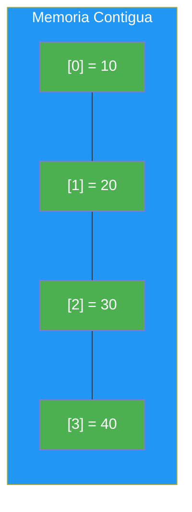
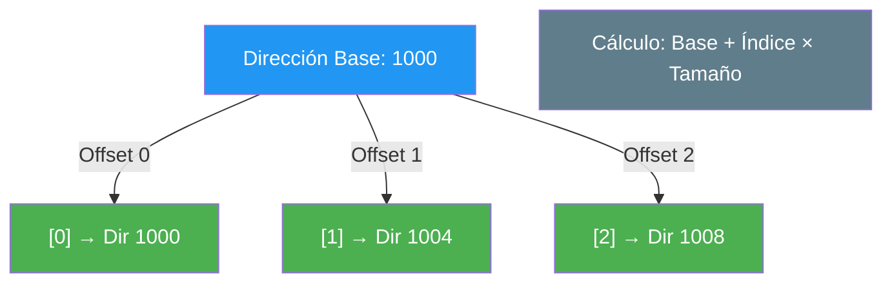
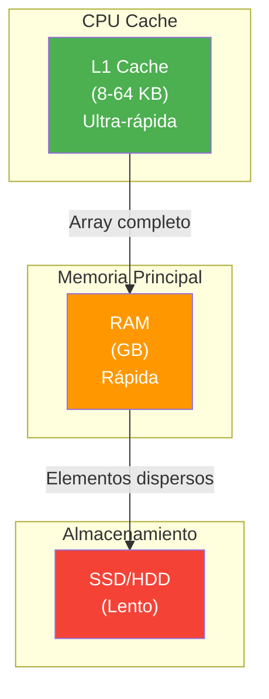

- [1. Arrays. Introducción](#1-arrays-introducción)
  - [1.1. Características Clave](#11-características-clave)
  - [1.2. El Problema de la Indexación (Índice Cero vs. Índice Uno)](#12-el-problema-de-la-indexación-índice-cero-vs-índice-uno)
    - [1.2.1. Indexación Basada en Cero](#121-indexación-basada-en-cero)
    - [1.2.2. Indexación Basada en Uno](#122-indexación-basada-en-uno)
  - [1.3. Arrays en C#](#13-arrays-en-c)
    - [1.3.1. El primer array que ya estás usando: `string[] args`](#131-el-primer-array-que-ya-estás-usando-string-args)
  - [1.4. El Secreto de la Velocidad: Localidad de Referencia](#14-el-secreto-de-la-velocidad-localidad-de-referencia)


# 1. Arrays. Introducción

> 💡 **Punto de partida:** ¿Alguna vez has abierto Netflix y has visto que te muestra 50 thumbnails de películas en una fila? ¿O Spotify que carga tu lista de 200 canciones favoritas? Detrás de todas esas colecciones de datos hay una estructura que las almacena de forma eficiente: el **array**.

En este punto aprenderás qué es un array, por qué es tan rápido, cómo se organiza en memoria y qué lo diferencia de otras estructuras de datos.

**Objetivos de aprendizaje:**

- Definir qué es un array y por qué es fundamental en programación
- Entender la diferencia entre indexación basada en cero y basada en uno
- Comprender la ventaja de rendimiento de los arrays (localidad de referencia)
- Conocer cuándo usar arrays frente a otras estructuras

## 1.1. Características Clave

Un **array** es una estructura de datos estática que almacena una colección ordenada de elementos del **mismo tipo**. Es como una cajonera: todos los cajones son del mismo tamaño y están pegados unos a otros.

1. **Homogeneidad (Tipo Fijo):** Todos los elementos deben ser del mismo tipo (`int[]`, `string[]`, `double[]`).
2. **Tamaño Fijo:** El tamaño se establece al crear el array y **no puede cambiarse**. Si necesitas más espacio, debes crear uno nuevo y copiar.
3. **Contigüidad en Memoria:** Los elementos se almacenan en posiciones de memoria **contiguas** (uno al lado del otro).
4. **Acceso por Índice:** Cada elemento se accede mediante su posición (índice), que es un número entero.
5. **Eficiencia:** El acceso es constante — tiempo $O(1)$, sin importar la posición (ver Punto 7).

> 💡 **Analogía:** Un array es como una hilera de casas en una calle. Cada casa tiene un número (índice) y están pegadas unas a otras. Si sabes el número de tu casa, llegas directamente sin preguntar a nadie.




📌 **Ejemplo real:** Spotify almacena tu lista de reproducción como un array de canciones. Cada canción tiene un índice (posición 0, 1, 2...) y todas son del mismo tipo. Cuando pulsas "siguiente", simplemente accede al siguiente índice.

## 1.2. El Problema de la Indexación (Índice Cero vs. Índice Uno)

Uno de los principales problemas al trabajar con arrays es la **indexación**: ¿cómo se numeran las posiciones? ¿La primera posición es la 0 o la 1?

### 1.2.1. Indexación Basada en Cero

El primer elemento está en el **índice 0**. Esta convención se basa en el cálculo directo de la dirección de memoria.

**Fundamento:** El índice representa el **desplazamiento** (*offset*) desde la dirección de inicio. El primer elemento no tiene desplazamiento, por lo que su índice es 0.



**Fórmula:**

```
Dirección(A[i]) = Dirección Base + (índice × Tamaño del Tipo)
```

Donde:
- `Dirección Base`: dirección del primer elemento (índice 0)
- `índice`: posición del elemento buscado
- `Tamaño del Tipo`: bytes que ocupa el tipo (ej. 4 bytes para `int`)

Este enfoque lo siguen C, C++, Java, JavaScript, Python, Kotlin y **C#**.

### 1.2.2. Indexación Basada en Uno

En algunos lenguajes (Fortran, MATLAB, Lua, Pascal) el primer elemento está en el **índice 1**.

**Fundamento:** El índice representa la **posición ordinal** — más intuitivo para el ser humano, pero complica el cálculo de memoria.

**Fórmula:**

```
Dirección(A[i]) = Dirección Base + ((índice - 1) × Tamaño del Tipo)
```

> ⚠️ **Advertencia:** Si vienes de lenguajes como Pascal o Visual Basic, cuidado. En C# el primer índice es **siempre 0**. Acceder a `array[array.Length]` lanza `IndexOutOfRangeException`.

> 💡 **Consejo:** Piensa así: si tienes 5 elementos, van del 0 al 4. Nunca del 1 al 5. El último siempre es `Length - 1`.

## 1.3. Arrays en C#

En C#, la indexación es **Cero-basada**. Si accedes a un índice negativo o a uno mayor o igual al tamaño, se produce un `IndexOutOfRangeException`.

📌 **Ejemplo real:** YouTube usa arrays internamente para almacenar los comentarios de un vídeo. Cuando hay 1000 comentarios, están en los índices 0 a 999. Si alguien intenta acceder al índice 1000, el sistema lanza una excepción para evitar leer memoria que no le pertenece.

```csharp
int[] edades = { 25, 30, 35, 40, 45 };

// ✅ BUENO: Acceso válido
Console.WriteLine(edades[0]);   // 25 (primer elemento)
Console.WriteLine(edades[4]);   // 45 (último → Length - 1)

// ❌ MALO: IndexOutOfRangeException
Console.WriteLine(edades[5]);   // Error: no existe el índice 5
Console.WriteLine(edades[-1]);  // Error: índice negativo
```

**Uso recomendado de arrays:**

- Se conoce el **tamaño máximo** de antemano
- Se necesita **acceso rápido** por posición
- No se añaden/eliminan elementos frecuentemente

> 📝 **Nota:** En la UD07 veremos las **colecciones dinámicas** (`List<T>`, `Dictionary<K,V>`) que resuelven el problema del tamaño fijo. Pero los arrays siguen siendo más rápidos para acceso por índice.

### El primer array que ya estás usando: `string[] args`

¿Has visto alguna vez esto en tu `Program.cs`?

```csharp
// Program.cs con Top-Level Statements
Console.WriteLine($"Argumentos recibidos: {args.Length}");
for (int i = 0; i < args.Length; i++)
{
    Console.WriteLine($"  args[{i}] = {args[i]}");
}
```

`args` es un **`string[]`** — un array unidimensional de cadenas. El sistema operativo te pasa los argumentos de línea de comandos como un array. Por ejemplo, si ejecutas:

```bash
dotnet run -- "Hola" "Mundo"
```

Entonces `args` contiene `{ "Hola", "Mundo" }` y `args.Length` es `2`.

📌 **Ejemplo real:** Cuando ejecutas `git commit -m "mensaje"`, Git recibe los argumentos como un array interno similar a `args`. Cada palabra que escribes después del comando es un elemento del array.

> 💡 **Consejo:** `string[] args` es tu primer contacto real con un array. Aprovéchalo para entender cómo se accede a los elementos por índice y cómo se recorre con `for`.

## 1.4. El Secreto de la Velocidad: Localidad de Referencia

¿Por qué usamos arrays si son tan rígidos? Por el **hardware**. Al estar los datos contiguos en memoria, cuando el procesador lee `[0]`, el sistema carga también los siguientes en la **Memoria Caché**. El procesador carga datos en bloques: si accedes a datos cercanos, ya están en caché. Si saltas a posiciones lejanas, ese bloque ya no sirve y hay que volver a cargarlo desde la RAM, que es más lenta.

```csharp
int[] numeros = { 10, 20, 30, 40, 50, 60, 70, 80, 90, 100 };

// ✅ Acceso SECUENCIAL (rápido — el procesador carga todo el bloque junto)
for (int i = 0; i < numeros.Length; i++)
{
    Console.WriteLine(numeros[i]);
}

// ❌ Acceso ALEATORIO (más lento — el procesador tiene que cargar bloques diferentes)
Console.WriteLine(numeros[0]);
Console.WriteLine(numeros[9]);
Console.WriteLine(numeros[5]);
```



📌 **Ejemplo real:** Netflix precarga las miniaturas de las siguiente 5-10 películas mientras ves la actual. Como están en un array contiguo, el procesador las carga todas a la vez en caché. Si estuvieran dispersas en memoria, la app iría lenta.

> 💡 **Consejo:** Usa arrays cuando:
> 1. Conozcas el tamaño exacto de antemano
> 2. Necesites acceso rápido por índice
> 3. Iteres secuencialmente (`for`/`foreach`)
>
> Usa `List<T>` cuando:
> 1. Necesitas añadir/quitar elementos frecuentemente
> 2. No conoces el tamaño final
> 3. Solo necesitas acceso secuencial

**Resumen del punto:**

| Concepto | Descripción |
| :--- | :--- |
| **Array** | Estructura de datos estática, elementos del mismo tipo, tamaño fijo |
| **Indexación basada en cero** | Primer elemento en índice 0 (C#, Java, Python) |
| **Indexación basada en uno** | Primer elemento en índice 1 (Fortran, MATLAB, Pascal) |
| **Contigüidad** | Elementos pegados en memoria → acceso $O(1)$ |
| **Localidad de referencia** | El procesador carga datos cercanos en caché |
| **`IndexOutOfRangeException`** | Error al acceder a un índice fuera de límites |

En el siguiente punto veremos cómo se crean y manipulan los arrays unidimensionales en C#: definición, creación, recorrido y paso por referencia.


## ¿Qué viene después?

En el siguiente punto veremos cómo se crean y manipulan los arrays unidimensionales en C#: definición, creación, recorrido y paso por referencia.

## Buenas Prácticas

- [ ] Usar arrays cuando conozcas el tamaño exacto y necesites acceso rápido por índice
- [ ] Usar `List<T>` cuando necesites añadir/quitar elementos frecuentemente
- [ ] Recordar que los arrays se indexan desde 0, no desde 1
- [ ] Verificar siempre `null` antes de acceder a un array de tipos anulables
