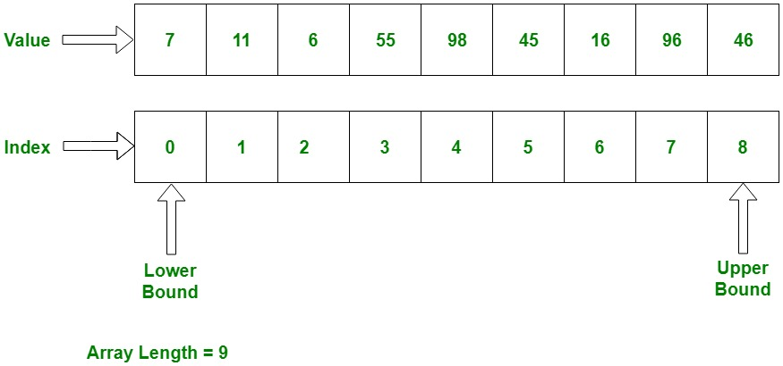
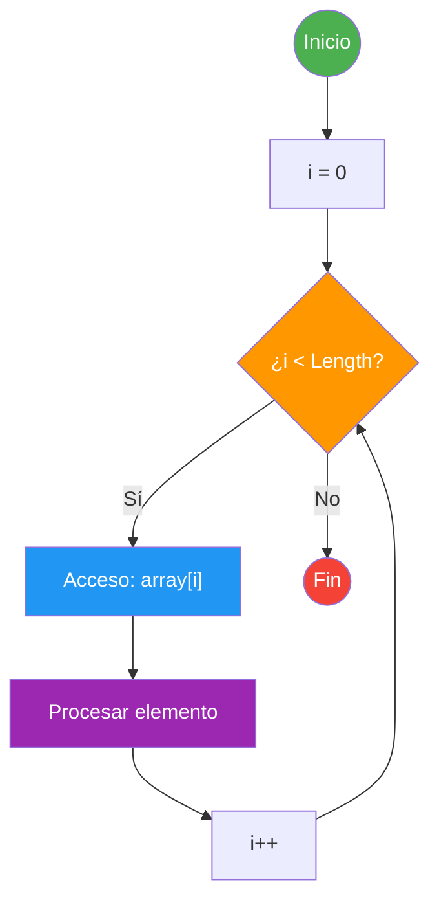
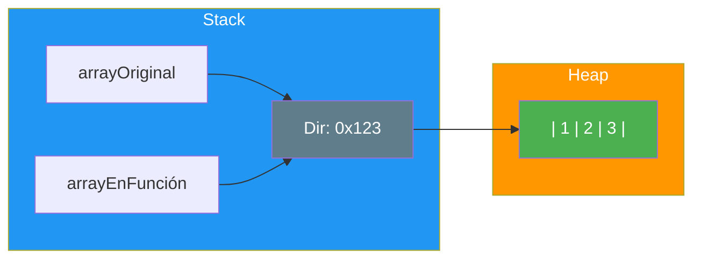
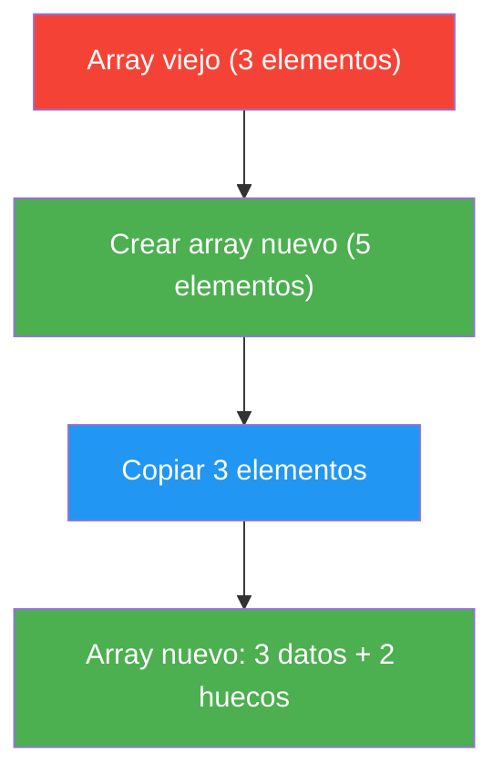
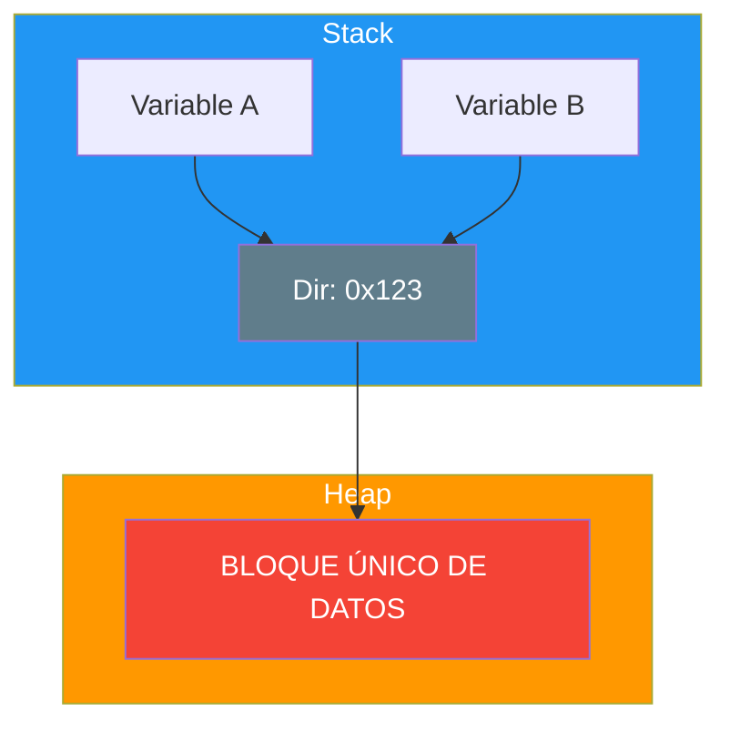

- [2. Arrays Unidimensionales](#2-arrays-unidimensionales)
  - [2.1. Definición, Creación y Valores por Defecto](#21-definición-creación-y-valores-por-defecto)
    - [2.1.1. Inmutabilidad del Tamaño y Creación](#211-inmutabilidad-del-tamaño-y-creación)
    - [2.1.2. Valores por Defecto y Gestión de la Nulidad](#212-valores-por-defecto-y-gestión-de-la-nulidad)
  - [2.2. Obtener el Tamaño con `.Length` y Recorrido](#22-obtener-el-tamaño-con-length-y-recorrido)
    - [2.2.1. `array.Length`](#221-arraylength)
    - [2.2.2. Recorrido con Bucle `for`](#222-recorrido-con-bucle-for)
    - [2.2.3. Recorrido con Bucle `foreach`](#223-recorrido-con-bucle-foreach)
    - [2.2.4. Recorrido con Filtrado de Nulos](#224-recorrido-con-filtrado-de-nulos)
  - [2.3. Paso por Referencia, Devolución y Clonación](#23-paso-por-referencia-devolución-y-clonación)
    - [2.3.1. Arrays y el Paso por Referencia](#231-arrays-y-el-paso-por-referencia)
    - [2.3.2. Clonación Manual para Romper la Referencia](#232-clonación-manual-para-romper-la-referencia)
    - [2.3.3. Devolución de Arrays](#233-devolución-de-arrays)
  - [2.4. Parámetros Variables (`params`) y Modificador `in`](#24-parámetros-variables-params-y-modificador-in)
  - [2.5. Identidad vs. Igualdad (Referencia vs. Contenido)](#25-identidad-vs-igualdad-referencia-vs-contenido)
  - [2.6. Copias, Clonación y la Inmutabilidad del Tamaño](#26-copias-clonación-y-la-inmutabilidad-del-tamaño)
  - [2.7. La Trampa del Alias](#27-la-trampa-del-alias)
  - [2.8. Arrays de Tipos Compuestos](#28-arrays-de-tipos-compuestos)

# 2. Arrays Unidimensionales

> 💡 **Punto de partida:** Cuando abres tu lista de reproducción de Spotify, ¿te has fijado en que cada canción tiene un número de posición? La canción 0, la 1, la 2... Eso es un array: una lista ordenada donde cada elemento tiene una posición fija. Pero, ¿cómo se crea? ¿Cómo se recorre? ¿Qué pasa si quieres hacer una copia?

En este punto aprenderás a crear, recorrer y manipular arrays unidimensionales en C#: definición, valores por defecto, bucles, paso por referencia y clonación.

**Objetivos de aprendizaje:**

- Declarar y crear arrays unidimensionales en C#
- Conocer los valores por defecto según el tipo de dato
- Recorrer arrays con `for` y `foreach`
- Entender el paso por referencia y la clonación
- Diferenciar identidad (`==`) de igualdad (contenido)
- Usar los modificadores `params` e `in`

## 2.1. Definición, Creación y Valores por Defecto

### 2.1.1. Inmutabilidad del Tamaño y Creación

| Característica | Detalle | Sintaxis C# |
| :--- | :--- | :--- |
| **Tamaño Fijo** | Se define al crear y **no puede cambiarse** | `int[] numeros = new int[10];` |
| **Homogeneidad** | Todos los elementos del mismo tipo | `var dias = new string[] { "Lun", "Mar", "Mié" };` |
| **Inicialización directa** | Asignar valores al crear | `int[] pares = { 2, 4, 6, 8 };` |

```csharp
// ✅ Creación con tamaño fijo (valores por defecto: 0)
int[] edades = new int[5];

// ✅ Creación con valores iniciales
string[] frutas = { "Manzana", "Pera", "Naranja" };

// ✅ Creación explícita
double[] precios = new double[] { 9.99, 19.99, 29.99 };
```



### 2.1.2. Valores por Defecto y Gestión de la Nulidad

Cuando creas un array solo con su tamaño, C# lo rellena automáticamente:

| Tipo de Array | Valor por Defecto | Ejemplo |
| :--- | :--- | :--- |
| **Numérico** (`int[]`, `double[]`) | `0` / `0.0` | `new int[3]` → `{ 0, 0, 0 }` |
| **Booleano** (`bool[]`) | `false` | `new bool[2]` → `{ false, false }` |
| **Cadena** (`string[]`) | `null` | `new string[2]` → `{ null, null }` |
| **Anulable** (`int?[]`) | `null` | `new int?[2]` → `{ null, null }` |

> 📝 **Nota:** Un tipo anulable (`int?`) permite guardar `null` además de números. Lo verás en detalle en la UD04 sobre POO.

> ⚠️ **Advertencia:** `string[]` se inicializa a `null`, **no** a `""`. Si intentas acceder a un método de un elemento sin verificar, obtendrás `NullReferenceException`.

```csharp
int?[] numerosOpcionales = new int?[3];
numerosOpcionales[0] = 5;

// ❌ Peligro: acceder a un null
// Console.WriteLine(numerosOpcionales[1] + 1);  // NullReferenceException

// ✅ Solución 1: Coalescencia
Console.WriteLine($"Con coalescencia: {(numerosOpcionales[1] ?? 0) + 1}");

// ✅ Solución 2: Comprobación explícita
if (numerosOpcionales[1] != null)
    Console.WriteLine($"Con if: {numerosOpcionales[1] + 1}");
else
    Console.WriteLine("Valor nulo, no se puede operar");
```

📌 **Ejemplo real:** Netflix usa arrays de perfiles. Si un usuario solo tiene 2 perfiles pero el array tiene 5 posiciones, las 3 restantes son `null`. Cuando intentas acceder a un perfil vacío, la app verifica el `null` antes de mostrar datos.

## 2.2. Obtener el Tamaño con `.Length` y Recorrido

### 2.2.1. `array.Length`

La propiedad `.Length` devuelve el número total de elementos. Es la forma fiable de conocer el límite del array.

```csharp
string[] colores = { "Rojo", "Verde", "Azul" };
Console.WriteLine($"Longitud: {colores.Length}");  // 3
Console.WriteLine($"Último índice: {colores.Length - 1}");  // 2
```

> 💡 **Consejo:** El último elemento siempre está en `array.Length - 1`. Si accedes a `array[array.Length]`, obtienes `IndexOutOfRangeException`.

### 2.2.2. Recorrido con Bucle `for`

El bucle `for` se usa cuando necesitas **modificar** elementos o conocer el **índice** actual.



```csharp
int[] calificaciones = new int[5];

// ✅ Recorrer y modificar con for
for (int i = 0; i < calificaciones.Length; i++)
{
    calificaciones[i] = i * 10;
    Console.WriteLine($"Índice {i}: {calificaciones[i]}");
}
// Salida: 0, 10, 20, 30, 40
```

📌 **Ejemplo real:** YouTube usa un bucle `for` para cargar los 50 primeros comentarios de un vídeo. Cada comentario se accede por su índice y se muestra en pantalla.

### 2.2.3. Recorrido con Bucle `foreach`

El `foreach` se usa cuando solo necesitas **leer** los valores. Es más seguro porque no puedes equivocarte con el índice.

```csharp
string[] diasSemana = { "L", "M", "X", "J", "V", "S", "D" };

// ✅ Recorrer con foreach (solo lectura)
foreach (string dia in diasSemana)
{
    Console.WriteLine($"Día: {dia}");
}
```

| Bucle | Cuándo usarlo | Ventaja |
| :--- | :--- | :--- |
| `for` | Necesitas modificar o conocer el índice | Acceso directo por posición |
| `foreach` | Solo necesitas leer cada elemento | Más seguro y legible |

### 2.2.4. Recorrido con Filtrado de Nulos

Para arrays de tipos anulables, debes verificar `null` antes de usar cada elemento.

```csharp
string?[] nombres = new string?[3];
nombres[0] = "Ana";
nombres[2] = "Luis";

// ✅ Filtrado con foreach + if
foreach (string? nombre in nombres)
{
    if (nombre != null)
        Console.WriteLine($"Usuario: {nombre}");
    else
        Console.WriteLine("Posición vacía");
}

// ✅ Alternativa más concisa con coalescencia
foreach (string? nombre in nombres)
{
    Console.WriteLine($"Usuario: {nombre ?? "vacío"}");
}
```

## 2.3. Paso por Referencia, Devolución y Clonación

### 2.3.1. Arrays y el Paso por Referencia

Los arrays en C# son **tipos de referencia**: la variable no contiene los datos, sino una **dirección de memoria** donde están. Esto significa que, al pasar un array a un método, se pasa la dirección (no se copian los elementos). Por eso puedes modificar los elementos dentro del método y se reflejan fuera. Pero cuidado: esto es diferente de usar `ref` (que verás más abajo).

**Al pasar un array a una función:** se pasa una **copia de la dirección** (referencia). Como dos variables apuntan al mismo sitio, modificar los elementos dentro de la función **afecta al original**.



```csharp
void ModificarContenido(int[] array)
{
    array[0] = 999;  // Modifica el contenido apuntado
}

int[] arrayOriginal = { 1, 2, 3 };
ModificarContenido(arrayOriginal);
Console.WriteLine(arrayOriginal[0]);  // 999 — ¡También cambió!
```

📌 **Ejemplo real:** Cuando editas una canción en una playlist de Spotify, la app modifica el array directamente. No crea una copia porque sería lento e ineficiente.

### 2.3.2. Clonación Manual para Romper la Referencia

Para obtener un array **completamente independiente**, debes crear uno nuevo y copiar elemento por elemento (**copia profunda**).

```csharp
int[] Clonar(int[] origen)
{
    int[] clonado = new int[origen.Length];
    for (int i = 0; i < origen.Length; i++)
    {
        clonado[i] = origen[i];  // Copia el valor
    }
    return clonado;
}

int[] arrayA = { 10, 20 };
int[] arrayClon = Clonar(arrayA);

arrayClon[0] = 500;
Console.WriteLine(arrayA[0]);    // 10 — A no cambia
Console.WriteLine(arrayClon[0]); // 500 — C es independiente
```

### 2.3.3. Devolución de Arrays

Una función que devuelve un array retorna la **referencia**. La variable que recibe el retorno apunta al mismo objeto.

```csharp
int[] CrearArray(int tamanho)
{
    return new int[tamanho];  // Retorna la referencia
}

int[] miArray = CrearArray(10);
Console.WriteLine(miArray.Length);  // 10
```

> 💡 **Consejo:** Usa comentarios XML `/// <summary>` en funciones que trabajen con arrays. Facilita la comprensión y la depuración del código.

> 📝 **Nota:** A veces necesitas devolver un array **junto con** otros valores (por ejemplo, el array y su suma). En ese caso, usa **tuplas** (que viste en la UD01/UD02):
>
> ```csharp
> (int[] datos, int suma) ProcesarArray(int[] arr)
> {
>     int s = 0;
>     foreach (int x in arr) s += x;
>     return (arr, s);
> }
>
> var (numeros, total) = ProcesarArray(new int[] { 10, 20, 30 });
> Console.WriteLine($"Suma: {total}");  // 60
> ```

## 2.4. Parámetros Variables (`params`) y Modificador `in`

El modificador **`params`** permite a una función aceptar un número variable de argumentos. Internamente, el compilador los convierte en un **array**.

```csharp
int SumarTodos(params int[] numeros)
{
    int suma = 0;
    foreach (int num in numeros)
    {
        suma += num;
    }
    return suma;
}

// ✅ Llamada con argumentos variables
Console.WriteLine(SumarTodos(1, 2, 3));          // 6
Console.WriteLine(SumarTodos(10, 20, 30, 40));   // 100
```

### El Modificador `in` (Solo Lectura)

El modificador `in` pasa un array por referencia pero **prohíbe modificarlo** dentro de la función. Ideal para arrays grandes donde solo necesitas leer.

```csharp
int SumarElementos(in int[] array)
{
    int suma = 0;
    foreach (int elemento in array)
    {
        suma += elemento;
    }
    // array[0] = 999;  // ❌ ERROR de compilación
    return suma;
}

int[] datos = { 10, 20, 30 };
Console.WriteLine(SumarElementos(in datos));  // 60
```

| Modificador | Modificable | Rendimiento | Cuándo usarlo |
| :--- | :--- | :--- | :--- |
| *(ninguno)* | Elementos sí, reasignar **no** | Copia la dirección (referencia) | Uso general — puedes modificar elementos |
| `ref` | Elementos sí, reasignar **sí** | Referencia directa | Cuando el método debe poder reemplazar el array completo |
| `in` | **No** | Referencia (solo lectura) | Arrays grandes, solo lectura |

## 2.5. Identidad vs. Igualdad (Referencia vs. Contenido)

| Concepto | Significado | Operador en C# |
| :--- | :--- | :--- |
| **Identidad** | ¿Apuntan a la **misma dirección**? | `==` |
| **Igualdad** | ¿Tienen el **mismo contenido**? | Función manual |

```csharp
bool SonIguales(int[] a, int[] b)
{
    if (a.Length != b.Length) return false;
    for (int i = 0; i < a.Length; i++)
    {
        if (a[i] != b[i]) return false;
    }
    return true;
}

int[] arrayA = { 1 };
int[] arrayB = { 1 };
int[] arrayC = arrayA;  // Misma referencia

Console.WriteLine(arrayA == arrayC);               // true (misma dirección)
Console.WriteLine(arrayA == arrayB);               // false (distinta dirección)
Console.WriteLine(SonIguales(arrayA, arrayB));      // true (mismo contenido)
```

> 🔧 **Truco mnemotecico:** `==` comprueba si son la **misma persona** (misma dirección). `SonIguales` comprueba si son **gemelos** (mismo contenido pero distinta persona).

## 2.6. Copias, Clonación y la Inmutabilidad del Tamaño

La propiedad `.Length` es de **solo lectura**. No puedes cambiar el tamaño de un array existente. Si necesitas más espacio, debes crear uno nuevo y copiar.



```csharp
int[] arrayAntiguo = { 10, 20, 30 };
int nuevoTamano = 5;
int[] arrayNuevo = new int[nuevoTamano];

// Copiar elementos del viejo al nuevo
for (int i = 0; i < arrayAntiguo.Length; i++)
{
    arrayNuevo[i] = arrayAntiguo[i];
}

// arrayNuevo = { 10, 20, 30, 0, 0 }
Console.WriteLine(string.Join(", ", arrayNuevo));
```

## 2.7. La Trampa del Alias

Un error muy común es pensar que al hacer `int[] b = a` has creado una copia. En realidad, has creado un **alias** — dos nombres para el mismo array.



**Consecuencia:** Si cambias `b[0]`, el valor de `a[0]` también cambia. No son dos arrays, son dos nombres para la misma "cajonera".

```csharp
// ❌ ERROR COMÚN: Aliasing
int[] a = { 1, 2, 3 };
int[] b = a;  // b es un ALIAS de a, NO una copia

b[0] = 999;
Console.WriteLine(a[0]);  // 999 — ¡También cambió!

// ✅ CORRECTO: Clonación
int[] c = new int[a.Length];
for (int i = 0; i < a.Length; i++)
    c[i] = a[i];

c[0] = 888;
Console.WriteLine(a[0]);  // 999 — a NO cambia
Console.WriteLine(c[0]);  // 888 — c es independiente
```

> 💡 **Analogía:** Imagina que `a` es la dirección de tu piso. Cuando escribes `b = a`, no estás comprando un piso nuevo, estás dando otra llave al **mismo piso**. Si `b` entra y mueve los muebles, `a` también ve los cambios.

📌 **Ejemplo real:** En un juego como Fortnite, si dos variables apuntan al mismo array de inventario y un jugador usa un objeto, el otro jugador también lo ve. Para evitarlo, el juego crea una **copia profunda** del inventario antes de modificarlo.

### El problema de `==` con arrays

Los arrays son **tipos por referencia**. Esto significa que `==` no compara el contenido, sino si ambas variables apuntan al **mismo objeto en memoria**.

```csharp
// ❌ == NO compara arrays por contenido
int[] a = { 1, 2, 3 };
int[] b = { 1, 2, 3 };
Console.WriteLine(a == b);  // ¡False! Son arrays diferentes

// ✅ Para comparar contenido, usa SequenceEqual()
Console.WriteLine(a.SequenceEqual(b));  // True

// ✅ O un bucle manual
bool iguales = a.Length == b.Length;
for (int i = 0; i < a.Length && iguales; i++)
    if (a[i] != b[i]) iguales = false;
```

> ⚠️ **Advertencia:** Este es uno de los errores más comunes. Si comparas dos arrays con `==`, siempre dará `False` aunque tengan los mismos valores, porque son objetos distintos en memoria.

### El problema de `null` con arrays

Los arrays pueden ser `null`. Si intentas acceder a `.Length` o a un índice de un array `null`, obtienes `NullReferenceException`.

```csharp
int[] numeros = null;

// ❌ Esto falla
Console.WriteLine(numeros.Length);  // NullReferenceException

// ✅ Comprobar antes de usar
if (numeros != null)
    Console.WriteLine(numeros.Length);

// ✅ Con operador ternario
int total = numeros?.Length ?? 0;
```

### Arrays de Tipos Compuestos

Los arrays no solo almacenan `int`, `string` o `bool`. También puedes guardar **tuplas**, **enums** y **structs** en un array.

#### Arrays de Tuplas

```csharp
// Array de tuplas con nombre
(string nombre, int nota)[] alumnos = 
{
    ("Ana", 8),
    ("Luis", 7),
    ("María", 9)
};

// Recorrer
for (int i = 0; i < alumnos.Length; i++)
    Console.WriteLine($"{alumnos[i].nombre}: {alumnos[i].nota}");
```

#### Arrays de Enums

```csharp
enum DiaSemana { Lunes, Martes, Miercoles, Jueves, Viernes, Sabado, Domingo }

// Array de enums
DiaSemana[] semana = 
{ 
    DiaSemana.Lunes, 
    DiaSemana.Miercoles, 
    DiaSemana.Viernes 
};

// Recorrer
foreach (DiaSemana dia in semana)
    Console.WriteLine($"Día: {dia}");

// Buscar un valor
for (int i = 0; i < semana.Length; i++)
{
    if (semana[i] == DiaSemana.Viernes)
        Console.WriteLine($"Viernes está en la posición {i}");
}
```

#### Arrays de Structs

```csharp
struct Alumno
{
    public int Id;
    public string Nombre;
    public double Nota;
}

// Array de structs
Alumno[] clase = new Alumno[3];
clase[0] = new Alumno { Id = 1, Nombre = "Ana", Nota = 8.5 };
clase[1] = new Alumno { Id = 2, Nombre = "Luis", Nota = 7.0 };
clase[2] = new Alumno { Id = 3, Nombre = "María", Nota = 9.2 };

// Recorrer
for (int i = 0; i < clase.Length; i++)
    Console.WriteLine($"{clase[i].Nombre} (ID {clase[i].Id}): {clase[i].Nota}");

// Con inicialización directa
Alumno[] clase2 = 
{
    new Alumno { Id = 1, Nombre = "Ana", Nota = 8.5 },
    new Alumno { Id = 2, Nombre = "Luis", Nota = 7.0 }
};
```

> 💡 **Nota:** Los structs son tipos de valor, así que cada elemento del array es una **copia independiente**. Si modificas `clase[0].Nota`, no afecta a otros arrays de la misma struct.

> 📌 **Ejemplo real:** Un videojuego almacena un array de structs `Personaje` con campos como `Nombre`, `Nivel`, `Vida`. Cada personaje es un elemento independiente del array.

**Resumen del punto:**

| Concepto | Descripción |
| :--- | :--- |
| **`new tipo[n]`** | Crea un array con n elementos (valores por defecto) |
| **`{ val1, val2 }`** | Inicialización directa con valores |
| **`.Length`** | Número total de elementos (solo lectura) |
| **`for`** | Recorre modificando o accediendo por índice |
| **`foreach`** | Recorre solo leyendo, sin índice |
| **Paso por referencia** | Modificar elementos afecta al original |
| **Clonación manual** | Copia profunda: crear nuevo array + copiar valores |
| **`params`** | Número variable de argumentos (se convierte en array) |
| **`in`** | Paso por referencia de solo lectura |
| **`==`** | Compara identidad (misma dirección), no contenido |
| **Alias** | `b = a` crea dos nombres para el mismo array |
| **Tuplas** | `(string, int)[]` — arrays de tuplas |
| **Enums** | `DiaSemana[]` — arrays de enumeraciones |
| **Structs** | `Alumno[]` — arrays de tipos de valor compuestos |

En el siguiente punto veremos cómo funcionan los arrays multidimensionales (matrices): su creación, recorrido y las diferencias clave con los unidimensionales.
