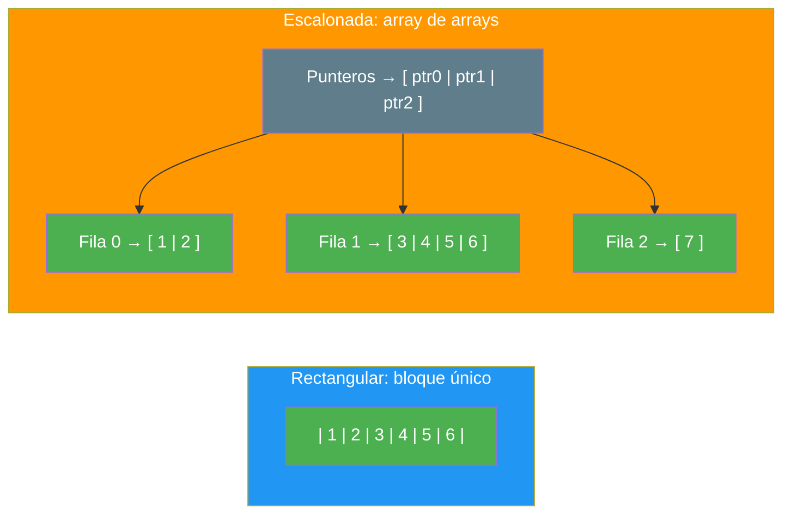
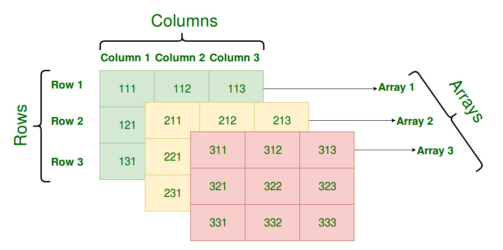
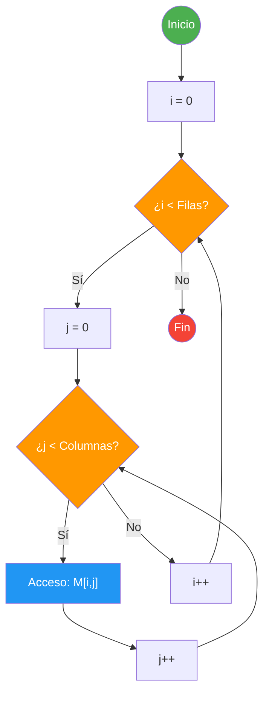
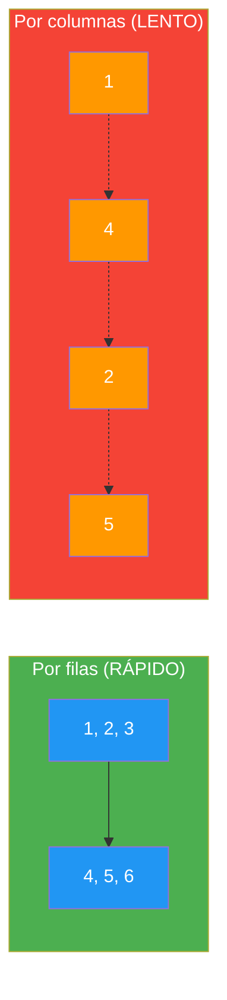

- [3. Arrays Multidimensionales](#3-arrays-multidimensionales)
  - [3.1. Conceptos Fundamentales](#31-conceptos-fundamentales)
    - [3.1.1. Tipos de Matrices](#311-tipos-de-matrices)
    - [3.1.2. Mecanismos de Almacenamiento](#312-mecanismos-de-almacenamiento)
      - [Matriz Rectangular: Un bloque contiguo](#matriz-rectangular-un-bloque-contiguo)
      - [Matriz Escalonada: Un array de arrays](#matriz-escalonada-un-array-de-arrays)
      - [Comparación rápida](#comparación-rápida)
  - [3.2. Declaración y Creación de Matrices](#32-declaración-y-creación-de-matrices)
    - [3.2.1. Matrices Rectangulares](#321-matrices-rectangulares)
    - [3.2.2. Matrices Escalonadas (Jagged)](#322-matrices-escalonadas-jagged)
  - [3.3. Recorrido con `for` y `foreach`](#33-recorrido-con-for-y-foreach)
    - [3.3.1. Bucle `for` (Acceso por Índice)](#331-bucle-for-acceso-por-índice)
    - [3.3.2. Bucle `foreach` (Lectura)](#332-bucle-foreach-lectura)
  - [3.4. Identidad, Igualdad y Clonación en Matrices](#34-identidad-igualdad-y-clonación-en-matrices)
  - [3.5. Paso por Referencia y Devolución de Matrices](#35-paso-por-referencia-y-devolución-de-matrices)
  - [3.6. Copias, Clonación Profunda y Cambio de Tamaño](#36-copias-clonación-profunda-y-cambio-de-tamaño)
  - [3.7. Rendimiento: El Orden de los Índices](#37-rendimiento-el-orden-de-los-índices)
  - [3.8. Matrices de Structs y Enums](#38-matrices-de-structs-y-enums)

# 3. Arrays Multidimensionales

> 💡 **Punto de partida:** ¿Alguna vez has visto un tablero de ajedrez? Tiene 8 filas y 8 columnas — 64 casillas. Para acceder a una casilla concreta, necesitas dos coordenadas: fila y columna. Eso es exactamente una **matriz**: un array con dos o más dimensiones.

En este punto aprenderás a crear, recorrer y manipular matrices en C#: rectangulares, escalonadas, clonación profunda y el secreto del rendimiento por el orden de los índices.

**Objetivos de aprendizaje:**

- Declarar matrices rectangulares y escalonadas
- Recorrer matrices con bucles anidados (`for` y `foreach`)
- Entender la diferencia entre copia superficial y copia profunda
- Conocer el impacto del orden de los índices en el rendimiento

## 3.1. Conceptos Fundamentales

### 3.1.1. Tipos de Matrices

| Tipo | Descripción | Ejemplo |
| :--- | :--- | :--- |
| **Rectangular** | Todas las filas tienen el mismo número de columnas | `int[3, 4]` — 3 filas × 4 columnas |
| **Escalonada (Jagged)** | Cada fila puede tener distinto número de columnas | `int[3][]` — 3 filas de tamaño variable |

### 3.1.2. Mecanismos de Almacenamiento

¿Por qué importa saber cómo se guardan las matrices en memoria? Porque afecta directamente a la **velocidad** de acceso y a la **forma de clonar**. Vamos a ver las dos opciones que ofrece C#.

#### Matriz Rectangular: Un bloque contiguo

Una matriz rectangular (`int[3, 4]`) se almacena como **un único bloque continuo** en memoria, como si fuera un vector largo. Los elementos se guardan **por filas**: primero la fila 0 completa, luego la fila 1, etc.

> 💡 **Analogía:** Imagina un libro de 3 capítulos con 4 páginas cada uno. El libro se imprime como un bloque de 12 páginas seguidas: páginas 0-3 (capítulo 0), páginas 4-7 (capítulo 1), páginas 8-11 (capítulo 2). No hay saltos ni pausas entre capítulos.

¿Cómo encuentra el procesador cada elemento? Usando una **fórmula** similar a la de los arrays unidimensionales:

```
Dirección(A[i,j]) = Dirección Base + ((i × NumColumnas + j) × Tamaño del Tipo)
```

Donde:
- `Dirección Base`: dirección del primer elemento (posición [0,0])
- `i`: índice de la fila
- `j`: índice de la columna
- `NumColumnas`: número de columnas de la matriz (necesario para calcular el desplazamiento)
- `Tamaño del Tipo`: bytes que ocupa el tipo (ej. 4 bytes para `int`)

📌 **Ejemplo:** Para una `int[3,4]` (4 bytes por int), si Base = 1000:
- `[0,0]` → 1000 + (0×4 + 0) × 4 = **1000**
- `[0,3]` → 1000 + (0×4 + 3) × 4 = **1012**
- `[1,0]` → 1000 + (1×4 + 0) × 4 = **1016** (fila 1, justo después de la fila 0)
- `[2,3]` → 1000 + (2×4 + 3) × 4 = **1040** (último elemento)

```
Memoria:  [1000][1004][1008][1012][1016][1020][1024][1028][1032][1036][1040][1044]
          ─────────────────────────  ─────────────────────────  ─────────────────────
                 Fila 0                      Fila 1                     Fila 2
```

> 📝 **Nota:** Esto es exactamente igual que en un array unidimensional, pero con un paso extra: multiplicar `i × NumColumnas` para "saltar" filas completas. La fórmula de unidimensionales era `Base + (índice × Tamaño)`, aquí el "índice lineal" es `i × NumColumnas + j`.

#### Matriz Escalonada: Un array de arrays

Una matriz escalonada (`int[3][]`) es **un array que contiene otros arrays**. Cada fila es un array independiente que se almacena en un sitio diferente de memoria.

> 💡 **Analogía:** Imagina un edificio de oficinas. La planta 0 tiene 2 despachos, la planta 1 tiene 4, y la planta 2 tiene 1. Cada planta es un "array" independiente, y el edificio es el "array de plantas". Las plantas no están pegadas: cada una está en su sitio.

```
Memoria:
  Array exterior → [ puntero_0, puntero_1, puntero_2 ]
                       ↓            ↓            ↓
  Fila 0    → [ 1 | 2 ]
  Fila 1    → [ 3 | 4 | 5 | 6 ]
  Fila 2    → [ 7 ]
```

¿Cómo se accede? Primero se busca el puntero de la fila, y luego se accede al elemento dentro de esa fila:

```
Dirección(A[i][j]) = Dirección del array fila[i] + (j × Tamaño del Tipo)
```

#### Comparación rápida

| Aspecto | Rectangular | Escalonada |
| :--- | :--- | :--- |
| **Memoria** | Un bloque contiguo | Varios bloques dispersos |
| **Fórmula acceso** | `Base + (i × Cols + j) × Tamaño` | `Ptr[i] + j × Tamaño` |
| **Velocidad** | Más rápida (caché-friendly) | Un poco más lenta (dos saltos) |
| **Flexibilidad** | Todas las filas igual tamaño | Filas de tamaño variable |
| **Clonación** | `Clone()` es profunda | `Clone()` es superficial |



## 3.2. Declaración y Creación de Matrices

### 3.2.1. Matrices Rectangulares

```csharp
// ✅ Creación con tamaño fijo (valores por defecto: 0)
int[,] matriz = new int[3, 4];  // 3 filas × 4 columnas

// ✅ Inicialización directa
int[,] notas = {
    { 5, 6, 7, 8 },   // Fila 0
    { 9, 10, 8, 7 },   // Fila 1
    { 6, 7, 9, 10 }    // Fila 2
};

// ✅ Acceso por índices
Console.WriteLine(notas[0, 2]);  // 7 (fila 0, columna 2)
notas[1, 0] = 10;               // Modificar valor

// ✅ Dimensiones
Console.WriteLine($"Filas: {notas.GetLength(0)}");    // 3
Console.WriteLine($"Columnas: {notas.GetLength(1)}");  // 4
```

### 3.2.2. Matrices Escalonadas (Jagged)

```csharp
// ✅ Matriz escalonada: cada fila tiene distinto tamaño
int[][] escalonada = new int[3][];
escalonada[0] = new int[] { 1, 2 };        // Fila 0: 2 columnas
escalonada[1] = new int[] { 3, 4, 5 };     // Fila 1: 3 columnas
escalonada[2] = new int[] { 6, 7, 8, 9 };  // Fila 2: 4 columnas

// ✅ Acceso
Console.WriteLine(escalonada[1][2]);  // 5 (fila 1, columna 2)
```

> 💡 **Consejo:** Usa matrices rectangulares cuando todas las filas tengan el mismo tamaño (tableros, imágenes). Usa escalonadas cuando las filas tengan tamaños diferentes (listas de usuarios con distintos números de amigos).



📌 **Ejemplo real:** Un tablero de Battleship es una matriz rectangular `char[10,10]` donde cada posición contiene un carácter como `'A'` (Agua), `'B'` (Barco) o `'D'` (Disparo). El juego necesita acceder rápidamente a cualquier casilla por sus coordenadas.

## 3.3. Recorrido con `for` y `foreach`

### 3.3.1. Bucle `for` (Acceso por Índice)



```csharp
int[,] matriz = { { 1, 2, 3 }, { 4, 5, 6 } };

// ✅ Recorrer por filas y columnas
for (int i = 0; i < matriz.GetLength(0); i++)
{
    for (int j = 0; j < matriz.GetLength(1); j++)
    {
        Console.Write($"{matriz[i,j]} ");
    }
    Console.WriteLine();
}
// Salida:
// 1 2 3
// 4 5 6
```

### 3.3.2. Bucle `foreach` (Lectura)

```csharp
int[,] matriz = { { 1, 2, 3 }, { 4, 5, 6 } };

// ✅ foreach recorre en orden de filas (row-major)
foreach (int elemento in matriz)
{
    Console.Write($"{elemento} ");
}
// Salida: 1 2 3 4 5 6
```

> ⚠️ **Advertencia:** Con `foreach` no puedes modificar los elementos ni conocer la posición (índice). Solo sirve para lectura. Si necesitas modificar, usa `for`.

## 3.4. Identidad, Igualdad y Clonación en Matrices

Al igual que los arrays unidimensionales, las matrices son **tipos de referencia**. `matrizB = matrizA` crea un alias, no una copia.

```csharp
int[,] original = { { 1, 2 }, { 3, 4 } };
int[,] copia = original;  // Alias — misma referencia

copia[0, 0] = 999;
Console.WriteLine(original[0, 0]);  // 999 — ¡También cambió!
```

### El problema de `==` con matrices

```csharp
// ❌ == NO compara matrices por contenido
int[,] a = { { 1, 2 }, { 3, 4 } };
int[,] b = { { 1, 2 }, { 3, 4 } };
Console.WriteLine(a == b);  // ¡False! Son matrices diferentes

// ✅ Para comparar contenido, usa un bucle
bool SonIguales(int[,] x, int[,] y)
{
    if (x.GetLength(0) != y.GetLength(0) || x.GetLength(1) != y.GetLength(1))
        return false;
    for (int i = 0; i < x.GetLength(0); i++)
        for (int j = 0; j < x.GetLength(1); j++)
            if (x[i, j] != y[i, j]) return false;
    return true;
}
```

> 🔧 **Truco mnemotecico:** Piensa en las matrices como un edificio de apartamentos. `matrizB = matrizA` es como darle a alguien la llave del **mismo** apartamento. Si mueve los muebles, tú también lo ves.

## 3.5. Paso por Referencia y Devolución de Matrices

Las matrices se pasan a funciones por referencia. Cualquier modificación dentro de la función afecta al original.

```csharp
void ModificarMatriz(int[,] matriz)
{
    matriz[0, 0] = 555;  // Modifica el original
}

int[,] miMatriz = { { 1, 2 }, { 3, 4 } };
ModificarMatriz(miMatriz);
Console.WriteLine(miMatriz[0, 0]);  // 555
```

Para devolver una matriz desde una función, se retorna la referencia:

```csharp
int[,] CrearMatriz(int filas, int columnas)
{
    return new int[filas, columnas];
}

int[,] nueva = CrearMatriz(3, 4);
Console.WriteLine($"{nueva.GetLength(0)}x{nueva.GetLength(1)}");  // 3x4
```

## 3.6. Copias, Clonación Profunda y Cambio de Tamaño

### Copia Superficial vs. Copia Profunda

| Tipo de Copia | Mecanismo | Resultado |
| :--- | :--- | :--- |
| **Referencia** | `matrizB = matrizA` | Total dependencia — mismo objeto |
| **Superficial** | Clonar solo el array exterior | Dependencia parcial — filas compartidas |
| **Profunda** | Clonar exterior **Y** cada fila | Total independencia |

```csharp
// Para matrices rectangulares, Clone() SÍ crea una copia profunda
// (porque es un bloque contiguo en memoria)
int[,] original = { { 1, 2 }, { 3, 4 } };
int[,] clonada = (int[,])original.Clone();

clonada[0, 0] = 999;
Console.WriteLine(original[0, 0]);  // 1 — NO cambia (el bloque es independiente)
```

> ⚠️ **Advertencia:** Con matrices **escalonadas** (`int[][]`), `Clone()` solo clona el array exterior. Las filas internas se comparten. Debes clonar cada fila manualmente.

```csharp
// ✅ CLONACIÓN PROFUNDA de matriz escalonada
int[][] ClonarMatriz(int[][] origen)
{
    int[][] clonada = new int[origen.Length][];
    for (int i = 0; i < origen.Length; i++)
    {
        clonada[i] = new int[origen[i].Length];
        for (int j = 0; j < origen[i].Length; j++)
        {
            clonada[i][j] = origen[i][j];
        }
    }
    return clonada;
}
```

### Cambio de Tamaño

El tamaño de una matriz es **inmutable**. Para "cambiarlo", debes crear una nueva y copiar.

```csharp
int[,] Original = { { 1, 2, 3 }, { 4, 5, 6 } };

// Ampliar de 2x3 a 4x5
int[,] nueva = new int[4, 5];
for (int i = 0; i < Original.GetLength(0); i++)
{
    for (int j = 0; j < Original.GetLength(1); j++)
    {
        nueva[i, j] = Original[i, j];
    }
}
// nueva = { {1,2,3,0,0}, {4,5,6,0,0}, {0,0,0,0,0}, {0,0,0,0,0} }
```

📌 **Ejemplo real:** Cuando escalas una imagen en Photoshop, internamente el programa crea una nueva matriz de píxeles con el tamaño ampliado y copia los valores originales, rellenando los huecos con interpolación.

## 3.7. Rendimiento: El Orden de los Índices

C# almacena matrices por **filas** (*row-major order*). Esto significa que los elementos de una fila se guardan consecutivos en memoria, y la fila completa sigue a la anterior:

```
Matriz int[2,3]:          Memoria:
| 1 | 2 | 3 |    →    [1][2][3][4][5][6]
| 4 | 5 | 6 |           Fila 0    Fila 1
```

> ⚠️ **Advertencia:** No todos los lenguajes funcionan igual. Fortran, MATLAB, R y Julia almacenan por **columnas** (*column-major order*): primero la columna completa, luego la siguiente. Si vienes de esos lenguajes, en C# el orden de recorrido es al revés. Esto es crucial para el rendimiento: lo que es rápido en MATLAB (recorrer por columnas) es lento en C#.

Recorrer por filas es **mucho más rápido** que recorrer por columnas:

```csharp
int[,] matriz = new int[1000, 1000];

// ✅ RÁPIDO: Recorrido por filas (cache-friendly)
for (int i = 0; i < 1000; i++)
    for (int j = 0; j < 1000; j++)
        matriz[i, j] = i + j;

// ❌ LENTO: Recorrido por columnas (cache misses)
for (int j = 0; j < 1000; j++)
    for (int i = 0; i < 1000; i++)
        matriz[i, j] = i + j;
```



> 💡 **Consejo:** Siempre recorre las matrices por filas (índice `i` primero). Esto garantiza que el procesador acceda a memoria contigua y aproveche la caché.

| Orden | Lenguajes | Fórmula | Ejemplo de recorrido rápido |
| :--- | :--- | :--- | :--- |
| **Row-major** (por filas) | C#, Java, Python, C++ | `Base + (i × Cols + j) × Size` | `for j → for i` ❌ / `for i → for j` ✅ |
| **Column-major** (por columnas) | Fortran, MATLAB, R, Julia | `Base + (j × Rows + i) × Size` | `for i → for j` ❌ / `for j → for i` ✅ |

> 📝 **Nota:** En C#, el bucle externo debe ser `i` (filas) y el interno `j` (columnas). En Fortran/MATLAB sería al revés. Si cambias de lenguaje, recuerda este detalle.

### Matrices de Structs y Enums

Al igual que los arrays unidimensionales, las matrices pueden almacenar **structs** y **enums**.

#### Matriz de Enums

```csharp
enum EstadoCasilla { Vacía, Árbol, Ardiente }

// Tablero de incendio forestal
EstadoCasilla[,] tablero = new EstadoCasilla[4, 4];

// Inicializar
tablero[0, 0] = EstadoCasilla.Árbol;
tablero[1, 2] = EstadoCasilla.Ardiente;

// Recorrer
for (int f = 0; f < 4; f++)
{
    for (int c = 0; c < 4; c++)
        Console.Write($"{tablero[f, c],-10}");
    Console.WriteLine();
}
```

#### Matriz de Structs

```csharp
struct Alumno
{
    public string Nombre;
    public double Nota;
}

// Matriz: 3 alumnos × 4 evaluciones
Alumno[,] notas = new Alumno[3, 4];

// Inicializar
notas[0, 0] = new Alumno { Nombre = "Ana", Nota = 8.5 };
notas[0, 1] = new Alumno { Nombre = "Ana", Nota = 7.0 };

// Recorrer
for (int f = 0; f < notas.GetLength(0); f++)
{
    for (int c = 0; c < notas.GetLength(1); c++)
        Console.Write($"{notas[f, c].Nota} ");
    Console.WriteLine();
}
```

> 💡 **Nota:** Cada celda de la matriz contiene una **copia** del struct. Si modificas `notas[0,0].Nota`, no afecta a其他celdas ni a其他matrices.

**Resumen del punto:**

| Concepto | Descripción |
| :--- | :--- |
| **Matriz rectangular** | `int[filas, columnas]` — todas las filas igual tamaño |
| **Matriz escalonada** | `int[filas][]` — filas de tamaño variable |
| **`.GetLength(n)`** | Devuelve el tamaño de la dimensión n |
| **Recorrido por filas** | Más rápido — memoria contigua (cache-friendly) |
| **Copia profunda** | Clonar exterior + cada fila (escalonadas) |
| **Cambio de tamaño** | Crear nueva matriz + copiar elementos |
| **`Clone()`** | Seguro para rectangulares, peligroso para escalonadas |
| **Enums** | `EstadoCasilla[,]` — matrices de enumeraciones |
| **Structs** | `Alumno[,]` — matrices de tipos de valor compuestos |

En el siguiente punto veremos la técnica del Doble Búfer (Double Buffering), un patrón de diseño que utiliza arrays para evitar el parpadeo en animaciones y juegos.
