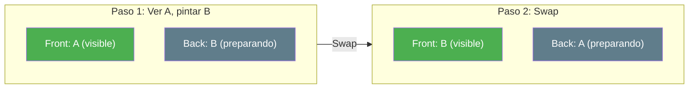
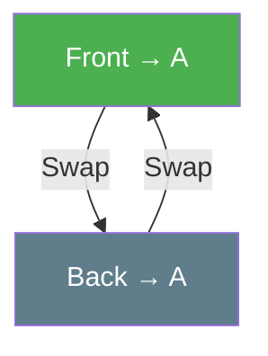

- [4. Doble Búfer (Double Buffering)](#4-doble-búfer-double-buffering)
  - [4.1. Teoría de la Técnica](#41-teoría-de-la-técnica)
  - [4.2. La Analogía del Pintor](#42-la-analogía-del-pintor)
  - [4.3. Mecanismo de Intercambio (Swap)](#43-mecanismo-de-intercambio-swap)
  - [4.4. Aplicación Didáctica: Propagación de Estado](#44-aplicación-didáctica-propagación-de-estado)
  - [4.5. ¿Por qué es vital en Desarrollo Web? El Problema del Tearing](#45-por-qué-es-vital-en-desarrollo-web-el-problema-del-tearing)
  - [4.6. Código en C#](#46-código-en-c)

# 4. Doble Búfer (Double Buffering)

> 💡 **Punto de partida:** ¿Alguna vez has jugado a un videojuego y has notado que la imagen se ve "rota" o parpadea? Eso es el **tearing**: el monitor muestra parte de un frame antiguo y parte de uno nuevo al mismo tiempo. La solución es una técnica llamada Doble Búfer.

En este punto aprenderás qué es el Doble Búfer, cómo funciona el mecanismo de Swap y por qué es esencial en animaciones, juegos y desarrollo web.

**Objetivos de aprendizaje:**

- Entender qué es el Doble Búfer y por qué existe
- Comprender el mecanismo de Swap (intercambio de referencias)
- Conocer la aplicación en desarrollo web y videojuegos

## 4.1. Teoría de la Técnica

El **Doble Búfer** es un patrón de diseño que utiliza **dos arrays** (búferes) para evitar el parpadeo. Mientras se muestra un búfer en pantalla, se prepara el siguiente en segundo plano.

| Búfer | Función |
| :--- | :--- |
| **Front Buffer** | El que se muestra en pantalla (visible) |
| **Back Buffer** | El que se está preparando (oculto) |

Cuando el Back Buffer está listo, se **intercambian** (swap) y el Back pasa a ser Front, y viceversa.

## 4.2. La Analogía del Pintor

> 💡 **Analogía:** Imagina un pintor que trabaja con **dos lienzos**. Mientras el público mira el Lienzo A (terminado), el pintor trabaja en el Lienzo B (preparando la siguiente escena). Cuando B está listo, los intercambia: el público ve B y el pintor empieza a trabajar en A de nuevo.



📌 **Ejemplo real:** Netflix usa Doble Búfer al reproducir vídeo. Mientras ves el frame actual (Front Buffer), el siguiente frame se descarga y prepara en el Back Buffer. Cuando llega el momento, se intercambian y la reproducción es fluida sin cortes.

## 4.3. Mecanismo de Intercambio (Swap)

El Swap **no copia datos** — solo intercambia las **referencias** (punteros) de los dos búferes. Por eso es $O(1)$: tiempo constante, sin importar el tamaño del array.



```csharp
// ✅ Mecanismo de Swap: intercambiar referencias
int[] front = { 1, 2, 3 };
int[] back = { 4, 5, 6 };

// Swap: solo intercambiar las referencias
(front, back) = (back, front);

// Ahora front = {4,5,6} y back = {1,2,3}
Console.WriteLine($"Front: [{string.Join(", ", front)}]");
Console.WriteLine($"Back: [{string.Join(", ", back)}]");
```

> ⚠️ **Advertencia:** Si en lugar de Swap haces una **copia** de los datos (`Array.Copy`), la operación pasa de $O(1)$ a $O(n)$ — mucho más lenta. El Swap es la clave de la eficiencia.

## 4.4. Aplicación Didáctica: Propagación de Estado

El Doble Búfer se usa para simular la **propagación de estado**: calcular el siguiente estado basándose en el actual, sin modificarlo mientras se calcula.

📌 **Ejemplo real:** En el juego de la Vida de Conway, cada célula se muere o nace según sus vecinas. El Doble Búfer asegura que todos los cálculos se hagan sobre el estado actual, y solo después se actualice el siguiente.

```csharp
int[] actual = { 0, 1, 1, 0, 1 };
int[] siguiente = new int[actual.Length];

// Calcular siguiente estado basándose en el actual
for (int i = 1; i < actual.Length - 1; i++)
{
    int vecinas = actual[i - 1] + actual[i + 1];
    siguiente[i] = vecinas == 2 ? 1 : 0;
}

// Swap cuando esté todo calculado
(actual, siguiente) = (siguiente, actual);
```

## 4.5. ¿Por qué es vital en Desarrollo Web? El Problema del Tearing

Sin Doble Búfer, el navegador dibuja la página directamente en el buffer visible. Si el usuario hace scroll mientras se está dibujando, ve una imagen **a medio pintar** (tearing).

Con Doble Búfer:
1. El navegador prepara el siguiente frame en el Back Buffer
2. Cuando está listo, hace Swap
3. El usuario ve un frame **completo**, nunca uno a medio pintar

> 📝 **Nota:** En desarrollo web, el navegador gestiona el Doble Búfer automáticamente a través de la **GPU**. Pero entender el concepto te ayuda a escribir código que aproveche esta técnica (por ejemplo, usando `requestAnimationFrame` en JavaScript o `CompositionTarget.Rendering` en WPF).

## 4.6. Código en C#

```csharp
// ✅ Doble Búfer completo: propagación de onda
int[] front = { 0, 0, 0, 0, 0, 0, 0, 0 };
int[] back = new int[front.Length];

// Fuente en el centro
front[front.Length / 2] = 1;

for (int frame = 0; frame < 5; frame++)
{
    Console.WriteLine($"Frame {frame}: [{string.Join(", ", front)}]");

    // Calcular siguiente estado
    for (int i = 1; i < front.Length - 1; i++)
    {
        int promedio = (front[i - 1] + front[i] + front[i + 1]) / 3;
        back[i] = promedio;
    }

    // Swap
    (front, back) = (back, front);
}
```

---

**Resumen del punto:**

| Concepto | Descripción |
| :--- | :--- |
| **Doble Búfer** | Dos arrays: uno visible, otro preparándose |
| **Front Buffer** | El que se muestra en pantalla |
| **Back Buffer** | El que se está calculando |
| **Swap** | Intercambio de referencias — $O(1)$ |
| **Tearing** | Imagen rota por mostrar frames a medio pintar |
| **Propagación de estado** | Calcular siguiente estado sin modificar el actual |

En el siguiente punto veremos las cadenas de texto en C#: su inmutabilidad, métodos esenciales y cómo construir textos eficientemente con `StringBuilder`.
