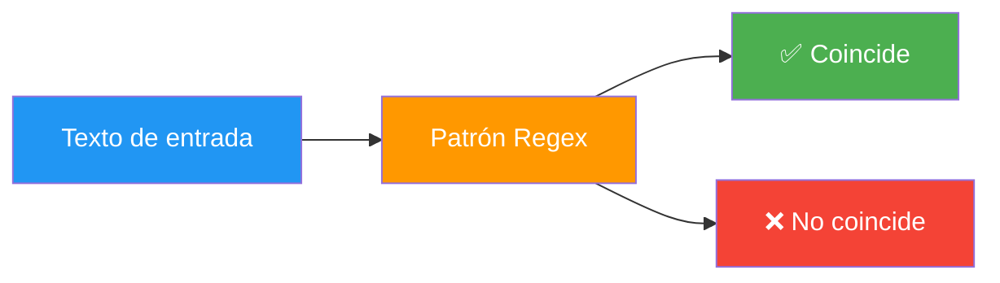

- [6. Expresiones Regulares (`Regex`)](#6-expresiones-regulares-regex)
  - [6.1. ¿Qué es una Expresión Regular?](#61-qué-es-una-expresión-regular)
  - [6.2. Metacaracteres Esenciales](#62-metacaracteres-esenciales)
  - [6.3. Uso de Regex en C#](#63-uso-de-regex-en-c)
    - [6.3.1. Validación (`IsMatch`)](#631-validación-ismatch)
    - [6.3.2. Búsqueda (`Match` y `Matches`)](#632-búsqueda-match-y-matches)
    - [6.3.3. Extracción de Datos](#633-extracción-de-datos)
    - [6.3.4. Sustitución (`Replace`)](#634-sustitución-replace)
  - [6.4. Tabla Maestra de Validaciones Comunes](#64-tabla-maestra-de-validaciones-comunes)
  - [6.5. El Concepto de Codicia (Greediness)](#65-el-concepto-de-codicia-greediness)


# 6. Expresiones Regulares (`Regex`)

> 💡 **Punto de partida:** ¿Alguna vez has tenido que validar si un email es correcto, si un teléfono tiene 9 dígitos o si un DNI tiene el formato adecuado? Hacerlo con `if` y `.Contains()` es tedioso y propenso a errores. Las **expresiones regulares** resuelven esto con un solo patrón.

En este punto aprenderás a crear patrones de búsqueda y validación de texto usando Regex en C#.

**Objetivos de aprendizaje:**

- Entender qué es una expresión regular y para qué sirve
- Conocer los metacaracteres esenciales
- Usar `Regex` para validar, buscar, extraer y sustituir texto
- Crear patrones comunes (email, teléfono, DNI, fecha)

## 6.1. ¿Qué es una Expresión Regular?

Una **expresión regular** (regex) es un **patrón de búsqueda** que describe un conjunto de cadenas de texto. Se usa para validar, buscar, extraer y sustituir texto de forma declarativa.

> 💡 **Analogía:** Una regex es como un filtro de búsqueda avanzado. Si buscar "texto" en Google es como usar `.Contains()`, una regex es como decir "quiero un email que empiece por letras, tenga una @, después un dominio y termine en .com".



📌 **Ejemplo real:** Instagram usa expresiones regulares para validar usernames. Cuando escribes un nombre de usuario, la app verifica con una regex que solo contenga letras, números, puntos y guiones bajos, y que tenga entre 3 y 30 caracteres.

## 6.2. Metacaracteres Esenciales

| Metacaracter | Significado | Ejemplo |
| :--- | :--- | :--- |
| `.` | Cualquier carácter | `a.c` → "abc", "a1c", "a c" |
| `\d` | Dígito (0-9) | `\d\d` → "42" |
| `\w` | Letra, dígito o `_` | `\w+` → "hola_123" |
| `\s` | Espacio en blanco | `a\sb` → "a b" |
| `+` | Una o más veces | `a+` → "a", "aa", "aaa" |
| `*` | Cero o más veces | `a*` → "", "a", "aa" |
| `?` | Cero o una vez | `colou?r` → "color", "colour" |
| `{n}` | Exactamente n veces | `\d{3}` → "123" |
| `{n,m}` | Entre n y m veces | `\d{2,4}` → "12", "123", "1234" |
| `^` | Inicio de cadena | `^Hola` → "Hola mundo" ✅ |
| `$` | Fin de cadena | `mundo$` → "Hola mundo" ✅ |
| `[abc]` | Cualquier carácter del conjunto | `[aeiou]` → vocal |
| `[^abc]` | Cualquier carácter NO del conjunto | `[^0-9]` → no dígito |
| `(abc)` | Grupo de captura | `(http\|https)` captura "http" o "https" |
| `\|` | Alternancia (OR) | `cat\|dog` → "cat" o "dog" |

```csharp
using System.Text.RegularExpressions;

// ✅ Validar que un string tiene exactamente 3 dígitos
string patron = @"^\d{3}$";
Console.WriteLine(Regex.IsMatch("123", patron));   // true
Console.WriteLine(Regex.IsMatch("12", patron));    // false
Console.WriteLine(Regex.IsMatch("1234", patron));  // false
```

> ⚠️ **Advertencia:** Usa `@""` (verbatim string) para las regex. Sin ella, `\d` causa un **error de compilación** ("Unrecognized escape sequence"). Con `@""`, se interpreta como el metacaracter `\d`.

## 6.3. Uso de Regex en C#

### 6.3.1. Validación (`IsMatch`)

```csharp
using System.Text.RegularExpressions;

// ✅ Validar email básico (versión simplificada)
string patronEmail = @"^[a-z0-9._%+-]+@[a-z0-9.-]+\.[a-z]{2,}$";
string email = "usuario@ejemplo.com";

bool esValido = Regex.IsMatch(email, patronEmail);
Console.WriteLine($"'{email}' es válido: {esValido}");  // true
```

### 6.3.2. Búsqueda (`Match` y `Matches`)

```csharp
string texto = "Mi número es 612-345-678 y otro es 911-222-333";

// ✅ Buscar la primera coincidencia
Match primera = Regex.Match(texto, @"\d{3}-\d{3}-\d{3}");
if (primera.Success)
    Console.WriteLine($"Primero: {primera.Value}");  // 612-345-678

// ✅ Buscar todas las coincidencias
MatchCollection todas = Regex.Matches(texto, @"\d{3}-\d{3}-\d{3}");
foreach (Match m in todas)
    Console.WriteLine($"Encontrado: {m.Value}");
```

### 6.3.3. Extracción de Datos (Grupos de Captura)

Los **paréntesis** `()` en una regex definen **grupos de captura**. Cada paréntesis captura una parte del texto y se accede a ella con `Groups[1]`, `Groups[2]`, etc. (el grupo 0 es la coincidencia completa).

```csharp
string log = "ERROR 2024-01-15: Archivo no encontrado";
//                    ───────── 
//                    Grupo 1: año, Grupo 2: mes, Grupo 3: día
Match coincidencia = Regex.Match(log, @"(\d{4})-(\d{2})-(\d{2})");

if (coincidencia.Success)
{
    Console.WriteLine($"Año: {coincidencia.Groups[1].Value}");   // 2024
    Console.WriteLine($"Mes: {coincidencia.Groups[2].Value}");   // 01
    Console.WriteLine($"Día: {coincidencia.Groups[3].Value}");   // 15
}
```

### 6.3.4. Sustitución (`Replace`)

En el segundo argumento de `Replace`, `$1` se sustituye por el contenido del primer grupo de captura, `$2` por el segundo, etc.

```csharp
string texto = "La fruta (manzana) y la verdura (lechuga) son sanas.";

// ✅ Eliminar contenido entre paréntesis
string limpio = Regex.Replace(texto, @"\s*\(.*?\)", "");
Console.WriteLine(limpio);  // "La fruta y la verdura son sanas."

// ✅ Enmascarar números de teléfono: $1 = primer grupo, $2 = segundo, $3 = tercero
string conMascara = Regex.Replace("612345678", @"(\d{3})(\d{3})(\d{3})", "$1-$2-$3");
Console.WriteLine(conMascara);  // "612-345-678"
```

## 6.4. Tabla Maestra de Validaciones Comunes

| Objetivo | Patrón | Explicación |
| :--- | :--- | :--- |
| **Solo dígitos** | `@"^\d+$"` | Una o más cifras |
| **Teléfono (9 dígitos)** | `@"^\d{9}$"` | Exactamente 9 cifras |
| **DNI (8 números + letra)** | `@"^\d{8}[A-Za-z]$"` | 8 dígitos + letra (mayúscula o minúscula) |
| **Email básico** | `@"^[a-z0-9._%+-]+@[a-z0-9.-]+\.[a-z]{2,}$"` | local@dominio.tld |
| **Fecha (DD/MM/AAAA)** | `@"^\d{2}/\d{2}/\d{4}$"` | 2d / 2d / 4d |
| **URL (HTTP/HTTPS)** | `@"^(http|https)://\w+\.\w+"` | protocolo://dominio |
| **Tarjeta de crédito** | `@"^\d{4} \d{4} \d{4} \d{4}$"` | 4 bloques de 4 dígitos |
| **Código postal (5 cifras)** | `@"^\d{5}$"` | 5 dígitos |

📌 **Ejemplo real:** Amazon usa regex para validar direcciones de envío. Cuando escribes un código postal, la app verifica que tenga exactamente 5 dígitos antes de aceptarlo.

## 6.5. El Concepto de Codicia (Greediness)

Por defecto, los cuantificadores (`+`, `*`) son **codiciosos**: intentan capturar la mayor cantidad de texto posible.

```csharp
string html = "<div>Hola</div>";

// ❌ Captura TODO (codicioso)
string codicioso = Regex.Match(html, @"<.*>").Value;
Console.WriteLine(codicioso);  // "<div>Hola</div>"

// ✅ Captura solo el primer tag (no codicioso / lazy)
string lazy = Regex.Match(html, @"<.*?>").Value;
Console.WriteLine(lazy);  // "<div>"
```

> 💡 **Consejo:** Siempre usa `?` después de `+` o `*` cuando valides HTML o XML. Sin él, la regex captura demasiado texto.

**Resumen del punto:**

| Concepto | Descripción |
| :--- | :--- |
| **Expresión regular** | Patrón de búsqueda y validación de texto |
| **Metacaracteres** | Símbolos especiales (`\d`, `\w`, `+`, `*`, `^`, `$`) |
| **`Regex.IsMatch()`** | Devuelve `true` si el texto cumple el patrón |
| **`Regex.Match()`** | Devuelve la primera coincidencia |
| **`Regex.Matches()`** | Devuelve todas las coincidencias |
| **`Regex.Replace()`** | Sustituye texto que cumpla el patrón |
| **Greediness** | `+`/`*` son codiciosos; añade `?` para hacerlos lazy |
| **Verbatim string** | Siempre usa `@""` para regex en C# |

## ¿Qué viene después?

En el siguiente punto veremos los algoritmos de ordenación y búsqueda: Burbuja, Selección, Inserción, Shell Sort, QuickSort y búsqueda lineal/binaria, analizando su eficiencia con la notación Big O.

## Buenas Prácticas

- [ ] Siempre usar `@""` (verbatim string) para patrones regex
- [ ] Anclar patrones con `^` y `$` para evitar coincidencias parciales
- [ ] Usar `?` después de `+` o `*` para hacer la regex lazy (no codiciosa)
- [ ] Probar las regex con casos válidos e inválidos
- [ ] No abusar de regex para validaciones simples — usar `.Contains()`, `.StartsWith()` cuando sea suficiente
- [ ] No abusar de regex para validaciones simples
