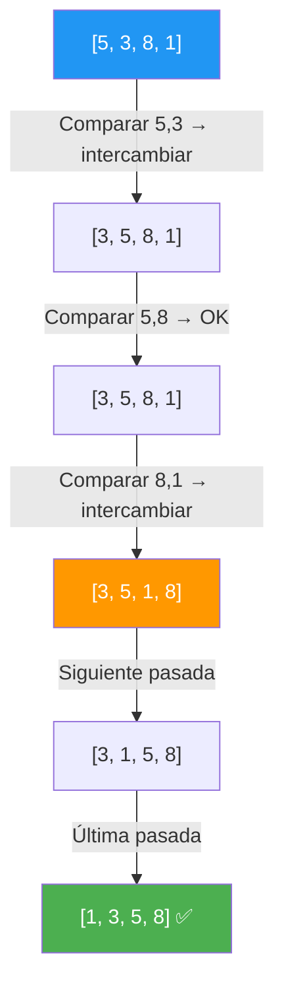
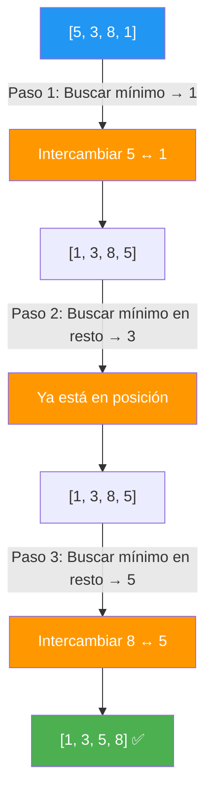
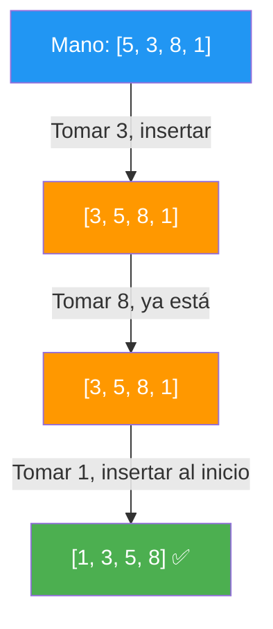
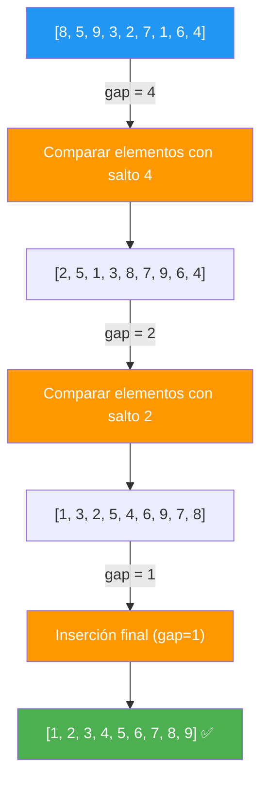
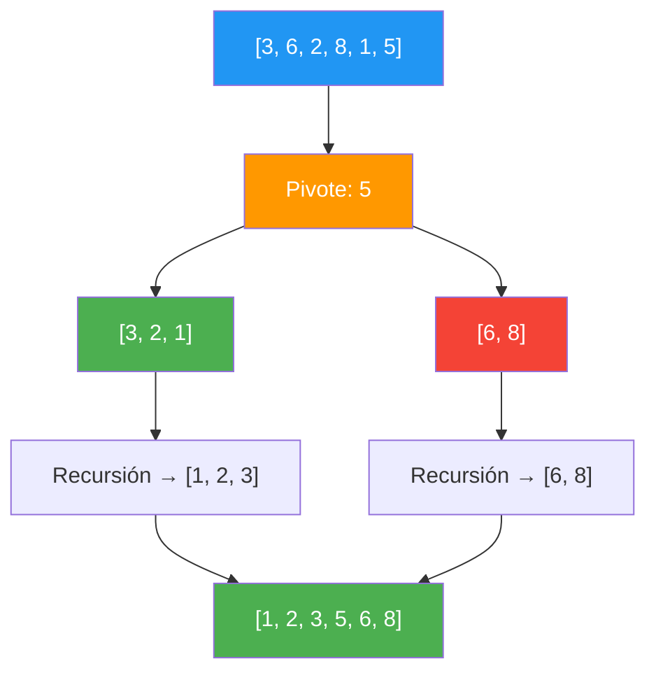
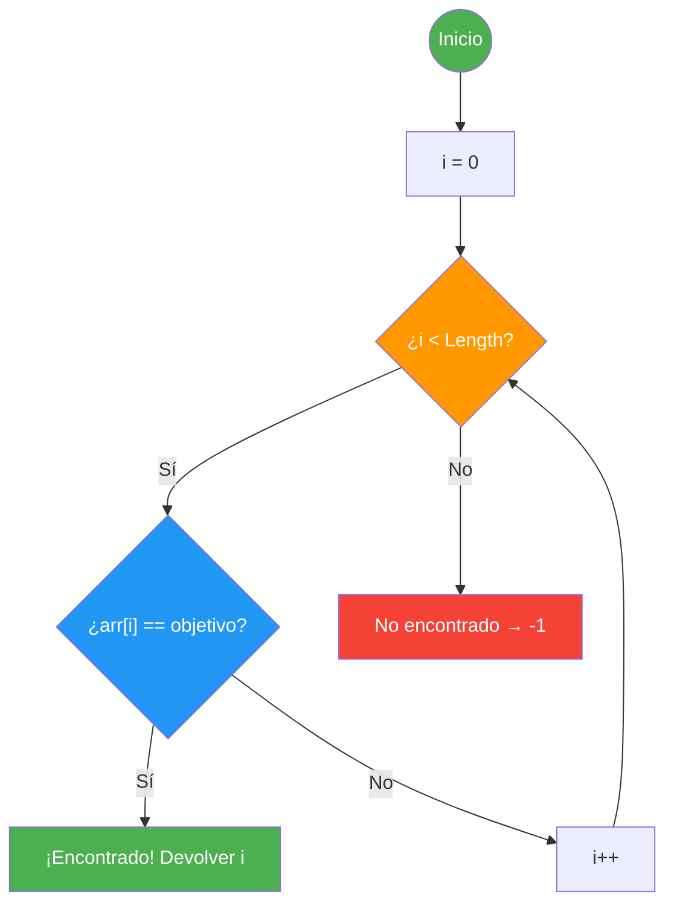
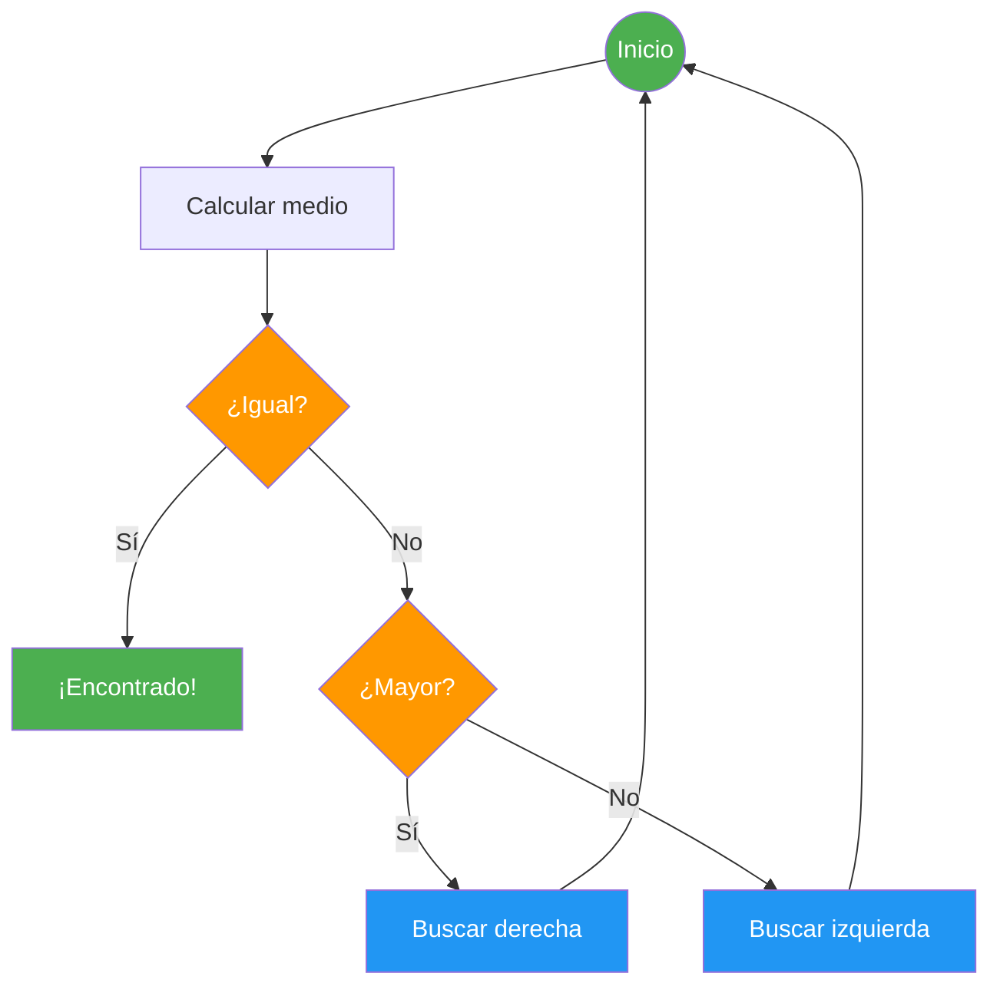

- [7. Algoritmos de Ordenación y Búsqueda](#7-algoritmos-de-ordenación-y-búsqueda)
  - [7.1. ¿Qué es la Notación Big O?](#71-qué-es-la-notación-big-o)
  - [7.2. Algoritmos de Ordenación (Sorting)](#72-algoritmos-de-ordenación-sorting)
    - [7.2.1. Burbuja (Bubble Sort)](#721-burbuja-bubble-sort)
    - [7.2.2. Selección (Selection Sort)](#722-selección-selection-sort)
    - [7.2.3. Inserción (Insertion Sort)](#723-inserción-insertion-sort)
    - [7.2.4. Shell Sort](#724-shell-sort)
    - [7.2.5. QuickSort](#725-quicksort)
  - [7.3. Algoritmos de Búsqueda (Searching)](#73-algoritmos-de-búsqueda-searching)
    - [7.3.1. Búsqueda Lineal](#731-búsqueda-lineal)
    - [7.3.2. Búsqueda Binaria](#732-búsqueda-binaria)
  - [7.4. Tabla Comparativa de Complejidad](#74-tabla-comparativa-de-complejidad)
  - [7.5. Cuándo Usar Cada Algoritmo](#75-cuándo-usar-cada-algoritmo)

# 7. Algoritmos de Ordenación y Búsqueda

> 💡 **Punto de partida:** ¿Alguna vez has abierto Netflix y has visto que las películas están ordenadas por "Más populares", "Estrenos recientes" o "Mi lista"? Detrás de ese orden hay algoritmos. Pero, ¿cuál es el mejor? ¿El más rápido siempre es el mejor?

En este punto aprenderás los algoritmos de ordenación más importantes (Burbuja, Selección, Inserción, Shell Sort, QuickSort) y los de búsqueda (Lineal y Binaria), analizando su eficiencia con la notación Big O.

**Objetivos de aprendizaje:**

- Entender la notación Big O y comparar rendimientos
- Implementar los algoritmos de ordenación básicos
- Implementar búsqueda lineal y binaria
- Saber cuándo usar cada algoritmo según el contexto

## 7.1. ¿Qué es la Notación Big O?

Antes de ver algoritmos, necesitamos una forma de **comparar** cuán rápido es cada uno. La **notación Big O** describe cómo crece el tiempo de ejecución cuando aumentan los datos de entrada.

> 💡 **Analogía:** Imagina que tienes que buscar un libro en una biblioteca. Si la biblioteca tiene 100 libros, puedes tardar poco. Si tiene 1.000.000, tardarás mucho más. Big O te dice **cómo de mucho más** tardarás cuando los datos crezcan.

| Big O | Nombre | Significado | Ejemplo práctico |
| :--- | :--- | :--- | :--- |
| $O(1)$ | **Constante** | Siempre el mismo tiempo, sin importar los datos | Acceder a `array[5]` |
| $O(\log n)$ | **Logarítmico** | Cada paso divide los datos por la mitad | Búsqueda Binaria |
| $O(n)$ | **Lineal** | Recorrer todo una vez | Búsqueda Lineal |
| $O(n \log n)$ | **Lineal-logarítmico** | Bueno para ordenar | QuickSort (promedio) |
| $O(n^2)$ | **Cuadrático** | Doble bucle anidado | Burbuja, Selección |

> 💡 **Truco:** Piensa en $n$ como el número de elementos. Si $n = 1.000.000$:
> - $O(1) = 1$ operación (instantáneo)
> - $O(\log n) ≈ 20$ operaciones (muy rápido)
> - $O(n) = 1.000.000$ operaciones (aceptable)
> - $O(n^2) = 1.000.000.000.000$ operaciones (¡nunca termina!)

**¿Qué significa "Estable"?** Un algoritmo es **estable** si mantiene el orden original de los elementos que tienen el mismo valor. Por ejemplo, si tienes dos películas con rating 5 y la primera aparece antes en la lista, después de ordenar, la primera sigue estando antes. Esto es importante cuando ordenas datos que tienen varios criterios.

📌 **Ejemplo real:** Netflix usa algoritmos estables para ordenar tu lista de favoritos: si dos películas tienen la misma prioridad, mantiene el orden en que las añadiste.

## 7.2. Algoritmos de Ordenación (Sorting)

De todos los algoritmos de ordenación, puedes visualizarlos interactivamente [aquí](https://www.cs.usfca.edu/~galles/visualization/Algorithms.html), [aquí](https://visualgo.net/en/sorting) y [aquí](https://algorithm-visualizer.org/).

### 7.2.1. Burbuja (Bubble Sort)

**Idea:** Imagina que estás en una cola de gente. Si alguien más alto está delante de alguien más bajo, se intercambian. Repites hasta que nadie necesita intercambiarse. Los elementos más grandes "burbujean" hacia el final, como burbujas que suben en el agua.

📌 **Ejemplo real:** En un casting de televisión, los directores ordenan a los actores por altura usando burbuja: comparan dos personas de pie una al lado de la otra, y si el de la izquierda es más alto, cambian de posición.



> 🎥 **Visualización del Algoritmo de Burbuja:** https://www.youtube.com/watch?v=lyZQPjUT5B4

```csharp
void Burbuja(int[] arr)
{
    for (int i = 0; i < arr.Length - 1; i++)
    {
        bool intercambio = false;
        for (int j = 0; j < arr.Length - 1 - i; j++)
        {
            if (arr[j] > arr[j + 1])
            {
                (arr[j], arr[j + 1]) = (arr[j + 1], arr[j]);
                intercambio = true;
            }
        }
        // Si no hubo intercambios, ya está ordenado
        if (!intercambio) break;
    }
}
```

> 📝 **Nota:** La versión optimizada incluye un flag `intercambio`. Si en una pasada completa no se intercambia nada, el array ya está ordenado y salimos antes. Con esta optimización, el mejor caso es $O(n)$ (ya ordenado). Sin ella, siempre es $O(n^2)$.

| Aspecto | Evaluación |
| :--- | :--- |
| **Mejor caso** | $O(n)$ — ya ordenado (con optimización) |
| **Peor caso** | $O(n^2)$ — orden inverso |
| **Estable** | ✅ Sí — preserva orden de elementos iguales |
| **Uso** | Didáctico, arrays pequeños |

### 7.2.2. Selección (Selection Sort)

**Idea:** Es como si organizaras un estante de libros: miras todos los libros, encuentras el más pequeño, y lo pones en la primera posición. Luego miras el resto, encuentras el siguiente más pequeño, y lo pones en la segunda posición. Repites hasta que todo esté ordenado.

📌 **Ejemplo real:** Un DJ que ordena sus discos por año de publicación: escanea todos los discos, encuentra el más antiguo, lo pone primero. Luego busca el siguiente más antiguo del resto, y así sucesivamente.



> 🎥 **Visualización del Algoritmo de Selección:** https://www.youtube.com/watch?v=Ns4TPTC8whw

```csharp
void Seleccion(int[] arr)
{
    for (int i = 0; i < arr.Length - 1; i++)
    {
        int minIdx = i;
        for (int j = i + 1; j < arr.Length; j++)
        {
            if (arr[j] < arr[minIdx])
                minIdx = j;
        }
        (arr[i], arr[minIdx]) = (arr[minIdx], arr[i]);
    }
}
```

| Aspecto | Evaluación |
| :--- | :--- |
| **Mejor caso** | $O(n^2)$ — siempre compara todo |
| **Peor caso** | $O(n^2)$ |
| **Estable** | ❌ No — puede cambiar orden de iguales |
| **Uso** | Cuando el intercambio es costoso (pocos intercambios) |

### 7.2.3. Inserción (Insertion Sort)

**Idea:** Es exactamente como ordenar cartas en la mano. Tomas una carta y la **insertas** en su posición correcta entre las que ya tienes ordenadas, desplazando las demás a la derecha.

📌 **Ejemplo real:** Netflix usa Inserción para ordenar tu "Lista de favoritos" cuando añades una sola película — como tiene pocos elementos, es rápido y estable. También es lo que usas cuando ordenas naipes en tu mano durante una partida de poker.



> 🎥 **Visualización del Algoritmo de Inserción:** https://www.youtube.com/watch?v=ROalU379l3U

```csharp
void Insercion(int[] arr)
{
    for (int i = 1; i < arr.Length; i++)
    {
        int clave = arr[i];
        int j = i - 1;
        while (j >= 0 && arr[j] > clave)
        {
            arr[j + 1] = arr[j];
            j--;
        }
        arr[j + 1] = clave;
    }
}
```

| Aspecto | Evaluación |
| :--- | :--- |
| **Mejor caso** | $O(n)$ — casi ordenado |
| **Peor caso** | $O(n^2)$ — orden inverso |
| **Estable** | ✅ Sí |
| **Uso** | Arrays pequeños o casi ordenados |

### 7.2.4. Shell Sort

**Idea:** Una mejora de Inserción. El problema de Inserción es que solo mueve elementos de un en un sitio. Shell Sort dice: "¿por qué no saltar varios sitios a la vez?". Empieza comparando elementos muy separados (con un "gap" grande) y va reduciendo el gap hasta 1 (que es Inserción normal).

> 💡 **Analogía:** Imagina que estás ordenando una fila de personas por altura. Primero comparas personas que están muy separadas (posición 0 con posición 5, posición 1 con posición 6...). Esto mueve a las personas más altas lejos de las más bajas rápidamente. Luego reduces la distancia y refinas. Es como hacer un borrador grueso primero y luego detallar.

📌 **Ejemplo real:** Los motores de bases de datos usan Shell Sort internamente para ordenar pequeños bloques de datos antes de fusionarlos con QuickSort.



> 🎥 **Visualización del Algoritmo Shell Sort:** https://youtu.be/J-t4OIdqs5c

```csharp
void ShellSort(int[] arr)
{
    int n = arr.Length;
    for (int gap = n / 2; gap > 0; gap /= 2)
    {
        for (int i = gap; i < n; i++)
        {
            int temp = arr[i];
            int j = i;
            while (j >= gap && arr[j - gap] > temp)
            {
                arr[j] = arr[j - gap];
                j -= gap;
            }
            arr[j] = temp;
        }
    }
}
```

| Aspecto | Evaluación |
| :--- | :--- |
| **Mejor caso** | $O(n \log n)$ |
| **Promedio** | $O(n^{1.5})$ — depende de la secuencia de gaps |
| **Peor caso** | $O(n^2)$ dependiendo del gap |
| **Estable** | ❌ No |
| **Uso** | Buen compromiso para arrays medianos |

### 7.2.5. QuickSort

**Idea:** El algoritmo de ordenación por **"Divide y Vencerás"** más utilizado. Es como separar una pila de cartas: eliges una carta como "pivote" (por ejemplo, la del medio). Pones todas las más pequeñas a la izquierda y las más grandes a la derecha. Luego repites con cada subpila. Es recursivo hasta que todo está ordenado.

📌 **Ejemplo real:** El método de ordenación de Google Search usa QuickSort internamente para ordenar millones de resultados por relevancia. Por eso aparecen tan rápido.

> 🎥 **Visualización del Algoritmo QuickSort:** https://www.youtube.com/watch?v=ywWBy6J5gz8



```csharp
void QuickSort(int[] arr, int bajo, int alto)
{
    if (bajo < alto)
    {
        int pivote = Partition(arr, bajo, alto);
        QuickSort(arr, bajo, pivote - 1);
        QuickSort(arr, pivote + 1, alto);
    }
}

int Partition(int[] arr, int bajo, int alto)
{
    int pivote = arr[alto];
    int i = bajo - 1;
    for (int j = bajo; j < alto; j++)
    {
        if (arr[j] < pivote)
        {
            i++;
            (arr[i], arr[j]) = (arr[j], arr[i]);
        }
    }
    (arr[i + 1], arr[alto]) = (arr[alto], arr[i + 1]);
    return i + 1;
}
```

| Aspecto | Evaluación |
| :--- | :--- |
| **Mejor caso** | $O(n \log n)$ |
| **Peor caso** | $O(n^2)$ — pivote mal elegido |
| **Estable** | ❌ No |
| **Uso** | El más rápido en la práctica para grandes volúmenes |

> 💡 **Consejo:** En la práctica, los lenguajes modernos usan variantes optimizadas de QuickSort en sus métodos de ordenación estándar. No necesitas implementarlo a mano, pero entenderlo te ayuda a elegir el mejor algoritmo.

## 7.3. Algoritmos de Búsqueda (Searching)

### 7.3.1. Búsqueda Lineal

**Idea:** Es como buscar una palabra en un diccionario **sin** usar el índice: abres la primera página, miras si está. Si no, pasas a la siguiente. Repites hasta encontrarla o llegar al final.

📌 **Ejemplo real:** Cuando buscas un contacto en tu móvil sin usar el buscador, simplemente deslizas hacia abajo mirando cada nombre. Eso es Búsqueda Lineal.

> 🎥 **Visualización de Búsqueda Lineal:** https://www.youtube.com/watch?v=-PuqKbu9K3U



```csharp
int BuscarLineal(int[] arr, int objetivo)
{
    for (int i = 0; i < arr.Length; i++)
    {
        if (arr[i] == objetivo)
            return i;  // Encontrado
    }
    return -1;  // No encontrado
}
```

| Aspecto | Evaluación |
| :--- | :--- |
| **Mejor caso** | $O(1)$ — primer elemento |
| **Peor caso** | $O(n)$ — último o no existe |
| **Requiere ordenación** | ❌ No |
| **Uso** | Arrays pequeños o no ordenados |

### 7.3.2. Búsqueda Binaria

**Idea:** Es como buscar una palabra en un diccionario **usando** el índice: abres por la mitad. Si la palabra que buscas va antes, miras en la primera mitad. Si va después, en la segunda. Cada paso elimina la mitad de opciones.

📌 **Ejemplo real:** El buscador de Netflix dentro de su catálogo usa Búsqueda Binaria sobre los títulos ordenados alfabéticamente. Con millones de películas, $O(\log n)$ es mucho más rápido que $O(n)$.

> 🎥 **Visualización de Búsqueda Binaria:** https://www.youtube.com/watch?v=iP897Z5Nerk



```csharp
int BuscarBinaria(int[] arr, int objetivo)
{
    int bajo = 0, alto = arr.Length - 1;
    while (bajo <= alto)
    {
        // Esta forma evita un posible desbordamiento de entero
        // que ocurriría con (bajo + alto) / 2
        int medio = bajo + (alto - bajo) / 2;
        if (arr[medio] == objetivo) return medio;
        else if (arr[medio] < objetivo) bajo = medio + 1;
        else alto = medio - 1;
    }
    return -1;
}
```

| Aspecto | Evaluación |
| :--- | :--- |
| **Mejor caso** | $O(1)$ — elemento central |
| **Peor caso** | $O(\log n)$ |
| **Requiere ordenación** | ✅ Sí |
| **Uso** | Arrays grandes y ordenados |

> 🔧 **Truco mnemotécnico:**
> - **Búsqueda Lineal** = Revisar cada estantería una por una
> - **Búsqueda Binaria** = Abrir el libro por la mitad y decidir si buscar en la primera o segunda parte

## 7.4. Tabla Comparativa de Complejidad

| Algoritmo | Mejor Caso | Promedio | Peor Caso | Estable |
| :--- | :---: | :---: | :---: | :---: |
| **Burbuja** | $O(n)$ | $O(n^2)$ | $O(n^2)$ | ✅ Sí |
| **Selección** | $O(n^2)$ | $O(n^2)$ | $O(n^2)$ | ❌ No |
| **Inserción** | $O(n)$ | $O(n^2)$ | $O(n^2)$ | ✅ Sí |
| **Shell Sort** | $O(n \log n)$ | $O(n^{1.5})$ | $O(n^2)$ | ❌ No |
| **QuickSort** | $O(n \log n)$ | $O(n \log n)$ | $O(n^2)$ | ❌ No |
| **Búsqueda Lineal** | $O(1)$ | $O(n)$ | $O(n)$ | N/A |
| **Búsqueda Binaria** | $O(1)$ | $O(\log n)$ | $O(\log n)$ | N/A |

> 📝 **Nota:** En C# puedes usar `Array.Sort(arr)` (usa Introsort, una variante de QuickSort) y `Array.BinarySearch(arr, valor)` (Búsqueda Binaria). En la práctica, usa estos métodos estándar en lugar de implementar los algoritmos a mano.

## 7.5. Cuándo Usar Cada Algoritmo

| Situación | Algoritmo Recomendado |
| :--- | :--- |
| **Array pequeño (<20 elementos)** | Inserción |
| **Array casi ordenado** | Inserción |
| **Array grande, sin requisitos especiales** | QuickSort (o `Array.Sort`) |
| **Estabilidad necesaria** | Burbuja o Inserción |
| **Búsqueda en array ordenado** | Búsqueda Binaria |
| **Búsqueda en array no ordenado** | Búsqueda Lineal |
| **Máximo rendimiento** | QuickSort + Búsqueda Binaria |

**Resumen del punto:**

| Concepto | Descripción |
| :--- | :--- |
| **Big O** | Notación para comparar rendimiento de algoritmos |
| **Burbuja** | Compara adyacentes, $O(n^2)$, estable |
| **Selección** | Busca mínimo, $O(n^2)$, no estable |
| **Inserción** | Inserta en posición, $O(n^2)$, estable |
| **Shell Sort** | Inserción con brechas, $O(n^{1.5})$ promedio |
| **QuickSort** | Divide y vencerás, $O(n \log n)$ promedio |
| **Búsqueda Lineal** | Recorre todo, $O(n)$ |
| **Búsqueda Binaria** | Divide por la mitad, $O(\log n)$, requiere ordenación |

En el siguiente punto cerraremos la unidad con un resumen completo: mapa conceptual, errores comunes, checklist de supervivencia y glosario de términos clave.
