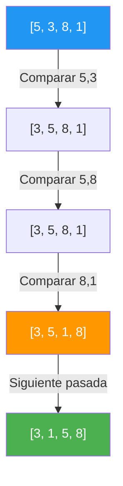
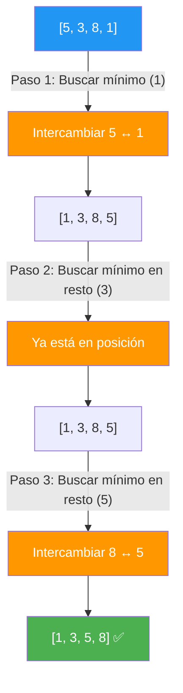
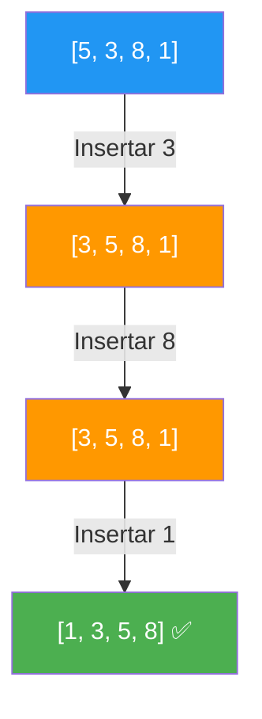
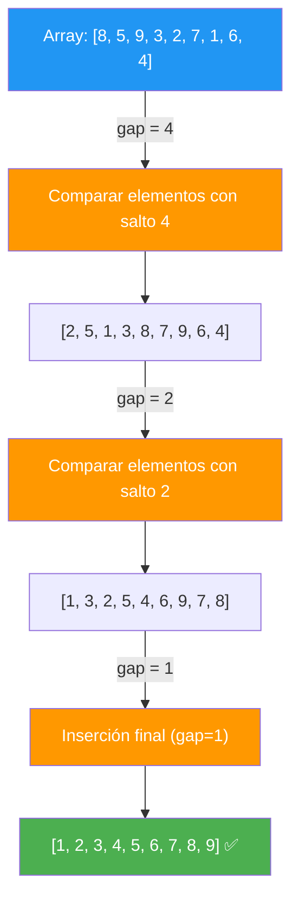
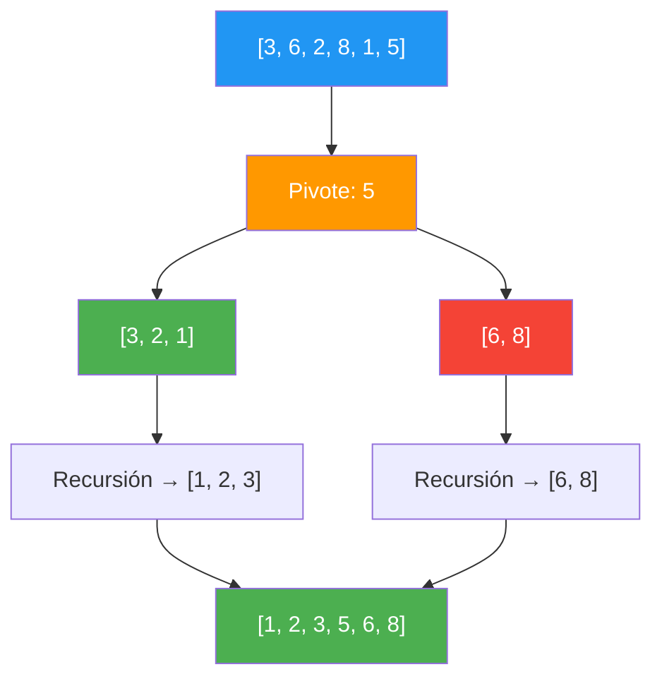
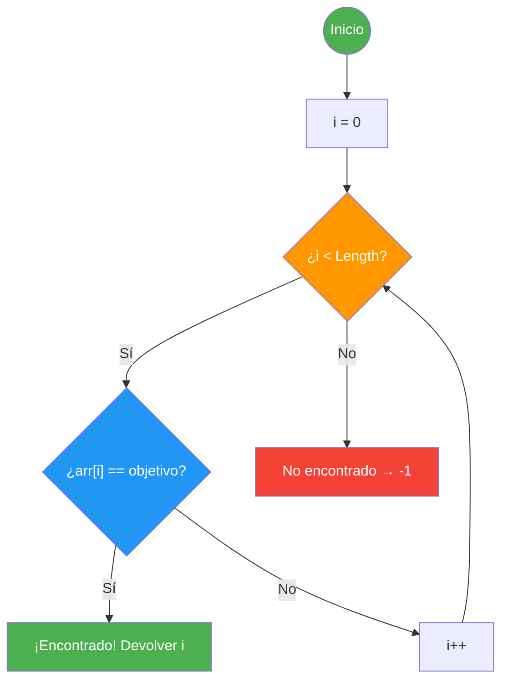

- [7. Algoritmos de Ordenación y Búsqueda](#7-algoritmos-de-ordenación-y-búsqueda)
  - [7.1. Algoritmos de Ordenación (Sorting)](#71-algoritmos-de-ordenación-sorting)
    - [7.1.1. Burbuja (Bubble Sort)](#711-burbuja-bubble-sort)
    - [7.1.2. Selección (Selection Sort)](#712-selección-selection-sort)
    - [7.1.3. Inserción (Insertion Sort)](#713-inserción-insertion-sort)
    - [7.1.4. Shell Sort](#714-shell-sort)
    - [7.1.5. QuickSort](#715-quicksort)
  - [7.2. Algoritmos de Búsqueda (Searching)](#72-algoritmos-de-búsqueda-searching)
    - [7.2.1. Búsqueda Lineal](#721-búsqueda-lineal)
    - [7.2.2. Búsqueda Binaria](#722-búsqueda-binaria)
  - [7.3. Tabla Comparativa de Complejidad (Big O)](#73-tabla-comparativa-de-complejidad-big-o)
  - [7.4. Cuándo Usar Cada Algoritmo](#74-cuándo-usar-cada-algoritmo)

# 7. Algoritmos de Ordenación y Búsqueda

> 💡 **Punto de partida:** ¿Alguna vez has abierto Netflix y has visto que las películas están ordenadas por "Más populares", "Estrenos recientes" o "Mi lista"? Detrás de ese orden hay algoritmos. Pero, ¿cuál es el mejor? ¿El más rápido siempre es el mejor?

En este punto aprenderás los algoritmos de ordenación más importantes (Burbuja, Selección, Inserción, Shell Sort, QuickSort) y los de búsqueda (Lineal y Binaria), analizando su eficiencia con la notación Big O.

**Objetivos de aprendizaje:**

- Implementar los algoritmos de ordenación básicos
- Entender la notación Big O y comparar rendimientos
- Implementar búsqueda lineal y binaria
- Saber cuándo usar cada algoritmo según el contexto

## 7.1. Algoritmos de Ordenación (Sorting)

### 7.1.1. Burbuja (Bubble Sort)

**Idea:** Compara elementos adyacentes y los intercambia si están en orden incorrecto. Los elementos más grandes "burbujean" hacia el final.



```csharp
void Burbuja(int[] arr)
{
    for (int i = 0; i < arr.Length - 1; i++)
    {
        for (int j = 0; j < arr.Length - 1 - i; j++)
        {
            if (arr[j] > arr[j + 1])
            {
                // Intercambiar
                (arr[j], arr[j + 1]) = (arr[j + 1], arr[j]);
            }
        }
    }
}
```

| Aspecto | Evaluación |
| :--- | :--- |
| **Mejor caso** | $O(n)$ — ya ordenado |
| **Peor caso** | $O(n^2)$ — orden inverso |
| **Estable** | ✅ Sí — preserva orden de elementos iguales |
| **Uso** | Didáctico, arrays pequeños |

### 7.1.2. Selección (Selection Sort)

**Idea:** Busca el elemento mínimo y lo pone en su posición correcta, repitiendo para el resto.



```csharp
void Seleccion(int[] arr)
{
    for (int i = 0; i < arr.Length - 1; i++)
    {
        int minIdx = i;
        for (int j = i + 1; j < arr.Length; j++)
        {
            if (arr[j] < arr[minIdx])
                minIdx = j;
        }
        (arr[i], arr[minIdx]) = (arr[minIdx], arr[i]);
    }
}
```

| Aspecto | Evaluación |
| :--- | :--- |
| **Mejor caso** | $O(n^2)$ — siempre compara todo |
| **Peor caso** | $O(n^2)$ |
| **Estable** | ❌ No — puede cambiar orden de iguales |
| **Uso** | Cuando el intercambio es costoso |

### 7.1.3. Inserción (Insertion Sort)

**Idea:** Similar a ordenar cartas en la mano. Cada elemento se inserta en su posición correcta entre los ya ordenados.



```csharp
void Insercion(int[] arr)
{
    for (int i = 1; i < arr.Length; i++)
    {
        int clave = arr[i];
        int j = i - 1;
        while (j >= 0 && arr[j] > clave)
        {
            arr[j + 1] = arr[j];
            j--;
        }
        arr[j + 1] = clave;
    }
}
```

| Aspecto | Evaluación |
| :--- | :--- |
| **Mejor caso** | $O(n)$ — casi ordenado |
| **Peor caso** | $O(n^2)$ — orden inverso |
| **Estable** | ✅ Sí |
| **Uso** | Arrays pequeños o casi ordenados |

📌 **Ejemplo real:** Netflix usa Inserción para ordenar tu "Lista de favoritos" cuando añades una sola película — como tiene pocos elementos, es rápido y estable.

### 7.1.4. Shell Sort

**Idea:** Una mejora de Inserción que compara elementos separados por una "brecha" (gap) que se reduce progresivamente.



```csharp
void ShellSort(int[] arr)
{
    int n = arr.Length;
    for (int gap = n / 2; gap > 0; gap /= 2)
    {
        for (int i = gap; i < n; i++)
        {
            int temp = arr[i];
            int j = i;
            while (j >= gap && arr[j - gap] > temp)
            {
                arr[j] = arr[j - gap];
                j -= gap;
            }
            arr[j] = temp;
        }
    }
}
```

| Aspecto | Evaluación |
| :--- | :--- |
| **Mejor caso** | $O(n \log n)$ |
| **Peor caso** | $O(n^2)$ dependiendo del gap |
| **Estable** | ❌ No |
| **Uso** | Buen compromiso para arrays medianos |

### 7.1.5. QuickSort

**Idea:** Elige un **pivote**, particiona el array en "menores que el pivote" y "mayores que el pivote", y aplica recursión.



```csharp
void QuickSort(int[] arr, int bajo, int alto)
{
    if (bajo < alto)
    {
        int pivote = Partition(arr, bajo, alto);
        QuickSort(arr, bajo, pivote - 1);
        QuickSort(arr, pivote + 1, alto);
    }
}

int Partition(int[] arr, int bajo, int alto)
{
    int pivote = arr[alto];
    int i = bajo - 1;
    for (int j = bajo; j < alto; j++)
    {
        if (arr[j] < pivote)
        {
            i++;
            (arr[i], arr[j]) = (arr[j], arr[i]);
        }
    }
    (arr[i + 1], arr[alto]) = (arr[alto], arr[i + 1]);
    return i + 1;
}
```

| Aspecto | Evaluación |
| :--- | :--- |
| **Mejor caso** | $O(n \log n)$ |
| **Peor caso** | $O(n^2)$ — pivote mal elegido |
| **Estable** | ❌ No |
| **Uso** | El más rápido en la práctica para grandes volúmenes |

> 💡 **Consejo:** En la práctica, los lenguajes modernos (C#, Java, Python) usan QuickSort o variantes (Introsort) en sus métodos de ordenación estándar. No necesitas implementarlo a mano, pero entenderlo te ayuda a elegir el mejor algoritmo.

## 7.2. Algoritmos de Búsqueda (Searching)

### 7.2.1. Búsqueda Lineal

**Idea:** Recorre el array elemento por elemento hasta encontrar el objetivo o llegar al final.



```csharp
int BuscarLineal(int[] arr, int objetivo)
{
    for (int i = 0; i < arr.Length; i++)
    {
        if (arr[i] == objetivo)
            return i;  // Encontrado
    }
    return -1;  // No encontrado
}
```

| Aspecto | Evaluación |
| :--- | :--- |
| **Mejor caso** | $O(1)$ — primer elemento |
| **Peor caso** | $O(n)$ — último o no existe |
| **Requiere ordenación** | ❌ No |
| **Uso** | Arrays pequeños o no ordenados |

### 7.2.2. Búsqueda Binaria

**Idea:** Divide el array por la mitad en cada paso. Si el objetivo es menor, busca en la izquierda; si es mayor, en la derecha. **Requiere array ordenado.**

```mermaid
graph TD
    S(("Inicio")) --> MID["Calcular medio"]
    MID --> COMP{"¿Igual?"}
    COMP -->|"Sí"| OK["¡Encontrado!"]
    COMP -->|"No"| DIR{"¿Mayor?"}
    DIR -->|"Sí"| DER["Buscar derecha"]
    DIR -->|"No"| IZQ["Buscar izquierda"]
    DER --> S
    IZQ --> S
    style S fill:#4CAF50,color:#fff
    style OK fill:#4CAF50,color:#fff
    style COMP fill:#FF9800,color:#fff
    style DIR fill:#FF9800,color:#fff
    style DER fill:#2196F3,color:#fff
    style IZQ fill:#2196F3,color:#fff
```



```csharp
int BuscarBinaria(int[] arr, int objetivo)
{
    int bajo = 0, alto = arr.Length - 1;
    while (bajo <= alto)
    {
        int medio = bajo + (alto - bajo) / 2;
        if (arr[medio] == objetivo) return medio;
        else if (arr[medio] < objetivo) bajo = medio + 1;
        else alto = medio - 1;
    }
    return -1;
}
```

| Aspecto | Evaluación |
| :--- | :--- |
| **Mejor caso** | $O(1)$ — elemento central |
| **Peor caso** | $O(\log n)$ |
| **Requiere ordenación** | ✅ Sí |
| **Uso** | Arrays grandes y ordenados |

📌 **Ejemplo real:** El buscador de Netflix dentro de su catálogo usa Búsqueda Binaria sobre los títulos ordenados alfabéticamente. Con millones de películas, $O(\log n)$ es mucho más rápido que $O(n)$.

> 🔧 **Truco mnemotecico:** 
> - **Búsqueda Lineal** = Revisar cada estantería una por una
> - **Búsqueda Binaria** = Abrir el libro por la mitad y decidir si buscar en la primera o segunda parte

## 7.3. Tabla Comparativa de Complejidad (Big O)

| Algoritmo | Mejor Caso | Promedio | Peor Caso | Estable |
| :--- | :---: | :---: | :---: | :---: |
| **Burbuja** | $O(n)$ | $O(n^2)$ | $O(n^2)$ | ✅ Sí |
| **Selección** | $O(n^2)$ | $O(n^2)$ | $O(n^2)$ | ❌ No |
| **Inserción** | $O(n)$ | $O(n^2)$ | $O(n^2)$ | ✅ Sí |
| **Shell Sort** | $O(n \log n)$ | $O(n^{1.5})$ | $O(n^2)$ | ❌ No |
| **QuickSort** | $O(n \log n)$ | $O(n \log n)$ | $O(n^2)$ | ❌ No |
| **Búsqueda Lineal** | $O(1)$ | $O(n)$ | $O(n)$ | N/A |
| **Búsqueda Binaria** | $O(1)$ | $O(\log n)$ | $O(\log n)$ | N/A |

> 📝 **Nota:** En C# puedes usar `Array.Sort(arr)` (usa Introsort, una variante de QuickSort) y `Array.BinarySearch(arr, valor)` (Búsqueda Binaria). En la práctica, usa estos métodos estándar en lugar de implementar los algoritmos a mano.

## 7.4. Cuándo Usar Cada Algoritmo

| Situación | Algoritmo Recomendado |
| :--- | :--- |
| **Array pequeño (<20 elementos)** | Inserción |
| **Array casi ordenado** | Inserción |
| **Array grande, sin requisitos especiales** | QuickSort (o `Array.Sort`) |
| **Estabilidad necesaria** | Burbuja o Inserción |
| **Búsqueda en array ordenado** | Búsqueda Binaria |
| **Búsqueda en array no ordenado** | Búsqueda Lineal |
| **Máximo rendimiento** | QuickSort + Búsqueda Binaria |

**Resumen del punto:**

| Concepto | Descripción |
| :--- | :--- |
| **Burbuja** | Compara adyacentes, $O(n^2)$, estable |
| **Selección** | Busca mínimo, $O(n^2)$, no estable |
| **Inserción** | Inserta en posición, $O(n^2)$, estable |
| **Shell Sort** | Inserción con brechas, $O(n \log n)$ |
| **QuickSort** | Divide y vencerás, $O(n \log n)$ promedio |
| **Búsqueda Lineal** | Recorre todo, $O(n)$ |
| **Búsqueda Binaria** | Divide por la mitad, $O(\log n)$, requiere ordenación |
| **Big O** | Notación para comparar rendimiento de algoritmos |

En el siguiente punto cerraremos la unidad con un resumen completo: mapa conceptual, errores comunes, checklist de supervivencia y glosario de términos clave.
