- [8. Resumen y Conclusiones UD03](#8-resumen-y-conclusiones-ud03)
  - [8.1. Mapa Conceptual de la Unidad](#81-mapa-conceptual-de-la-unidad)
  - [8.2. Conceptos Clave](#82-conceptos-clave)
    - [Introducción a los Arrays](#introducción-a-los-arrays)
    - [Arrays Unidimensionales](#arrays-unidimensionales)
    - [Arrays Multidimensionales](#arrays-multidimensionales)
    - [Doble Búfer](#doble-búfer)
    - [Cadenas de Texto](#cadenas-de-texto)
    - [Expresiones Regulares](#expresiones-regulares)
    - [Algoritmos de Ordenación y Búsqueda](#algoritmos-de-ordenación-y-búsqueda)
  - [8.3. Herramientas y Perfiles](#83-herramientas-y-perfiles)
  - [8.4. Errores Comunes a Evitar](#84-errores-comunes-a-evitar)
  - [8.5. Checklist de Supervivencia](#85-checklist-de-supervivencia)
  - [8.6. Glosario de Términos](#86-glosario-de-términos)
  - [8.7. Ejercicios de Repaso](#87-ejercicios-de-repaso)
  - [8.8. ¿Qué viene después?](#88-qué-viene-después)
  - [8.9. Mapa de Conexiones entre Temas](#89-mapa-de-conexiones-entre-temas)

# 8. Resumen y Conclusiones UD03

> 💡 **Punto de partida:** Has pasado de manejar variables individuales a manipular colecciones enteras de datos. Has aprendido a almacenar, recorrer, ordenar, buscar y validar información. Estas son las bases sobre las que se construye toda la programación real.

**Objetivos de aprendizaje:**

- Repasar los conceptos fundamentales de la unidad
- Consolidar el vocabulario técnico
- Tener una referencia rápida para el examen

## 8.1. Mapa Conceptual de la Unidad

```mermaid
graph TD
    UD03["UD03: Almacenamiento<br/>Estático y Cadenas"] --> ARR["Arrays"]
    UD03 --> CAD["Cadenas"]
    UD03 --> ORD["Ordenación y<br/>Búsqueda"]
    ARR --> A1["Introducción"]
    ARR --> A2["Unidimensionales"]
    ARR --> A3["Multidimensionales"]
    ARR --> A4["Doble Búfer"]
    A1 --> A11["Indexación basada en 0"]
    A1 --> A12["Localidad de referencia"]
    A2 --> A21["Creación y valores por defecto"]
    A2 --> A22["Recorrido (for/foreach)"]
    A2 --> A23["Paso por referencia"]
    A2 --> A24["Clonación y alias"]
    A2 --> A25["params e in"]
    A3 --> A31["Rectangulares vs escalonadas"]
    A3 --> A32["Recorrido con bucles anidados"]
    A3 --> A33["Clonación profunda"]
    A3 --> A34["Orden de índices (rendimiento)"]
    A4 --> A41["Front y Back Buffer"]
    A4 --> A42["Swap O(1)"]
    CAD --> C1["Inmutabilidad"]
    CAD --> C2["Métodos esenciales"]
    CAD --> C3["StringBuilder"]
    CAD --> C4["String Interning"]
    ORD --> O1["Ordenación"]
    ORD --> O2["Búsqueda"]
    O1 --> O11["Burbuja, Selección, Inserción"]
    O1 --> O12["Shell Sort, QuickSort"]
    O2 --> O21["Lineal O(n)"]
    O2 --> O22["Binaria O(log n)"]
    RE["Expresiones Regulares"] --> RE1["Metacaracteres"]
    RE --> RE2["IsMatch, Match, Replace"]
    RE --> RE3["Validaciones comunes"]
    UD03 --> RE
    style UD03 fill:#2196F3,color:#fff
    style ARR fill:#4CAF50,color:#fff
    style CAD fill:#FF9800,color:#fff
    style ORD fill:#9C27B0,color:#fff
    style RE fill:#f44336,color:#fff
    style A1 fill:#607D8B,color:#fff
    style A2 fill:#607D8B,color:#fff
    style A3 fill:#607D8B,color:#fff
    style A4 fill:#607D8B,color:#fff
    style C1 fill:#607D8B,color:#fff
    style C2 fill:#607D8B,color:#fff
    style C3 fill:#607D8B,color:#fff
    style C4 fill:#607D8B,color:#fff
    style O1 fill:#607D8B,color:#fff
    style O2 fill:#607D8B,color:#fff
    style RE1 fill:#607D8B,color:#fff
    style RE2 fill:#607D8B,color:#fff
    style RE3 fill:#607D8B,color:#fff
```



## 8.2. Conceptos Clave

### Introducción a los Arrays

- **Array:** Estructura de datos estática, elementos del mismo tipo, tamaño fijo
- **Indexación basada en cero:** Primer elemento en índice 0 (C#, Java, Python)
- **Contigüidad en memoria:** Elementos pegados → acceso $O(1)$
- **Localidad de referencia:** El procesador carga datos cercanos en caché
- **`IndexOutOfRangeException`:** Error al acceder a un índice fuera de límites

📌 **Ejemplo real:** Spotify almacena tu lista de reproducción como un array de canciones. Cada canción tiene un índice y todas son del mismo tipo.

### Arrays Unidimensionales

- **Creación:** `int[] arr = new int[5];` o `int[] arr = { 1, 2, 3 };`
- **Valores por defecto:** Numéricos → `0`, bool → `false`, string → `null`
- **`.Length`:** Número total de elementos (solo lectura)
- **`for`:** Recorre modificando o accediendo por índice
- **`foreach`:** Recorre solo leyendo, sin índice
- **Paso por referencia:** Modificar elementos afecta al original
- **Clonación manual:** Crear nuevo array + copiar valores (copia profunda)
- **`params`:** Número variable de argumentos (se convierte en array)
- **`in`:** Paso por referencia de solo lectura
- **Identidad vs igualdad:** `==` compara dirección, no contenido
- **Alias:** `b = a` crea dos nombres para el mismo array

📌 **Ejemplo real:** YouTube usa un bucle `for` para cargar los 50 primeros comentarios de un vídeo.

### Arrays Multidimensionales

- **Rectangular:** `int[filas, columnas]` — todas las filas igual tamaño
- **Escalonada:** `int[filas][]` — filas de tamaño variable
- **`.GetLength(n)`:** Tamaño de la dimensión n
- **Recorrido por filas:** Más rápido — memoria contigua (cache-friendly)
- **Copia profunda:** Clonar exterior + cada fila (escalonadas)
- **`Clone()`:** Seguro para rectangulares, peligroso para escalonadas

📌 **Ejemplo real:** Un tablero de Battleship es una matriz `char[10,10]` donde cada posición contiene `'Agua'`, `'Barco'` o `'Disparo'`.

### Doble Búfer

- **Front Buffer:** El que se muestra en pantalla
- **Back Buffer:** El que se está preparando
- **Swap:** Intercambio de referencias — $O(1)$
- **Tearing:** Imagen rota por mostrar frames a medio pintar

📌 **Ejemplo real:** Netflix usa Doble Búfer al reproducir vídeo. Mientras ves el frame actual, el siguiente se descarga en el Back Buffer.

### Cadenas de Texto

- **Inmutabilidad:** `string` no puede modificarse — cada cambio crea una nueva
- **Acceso por índice:** `cadena[i]` devuelve el carácter en posición i
- **Métodos esenciales:** `Contains`, `Replace`, `Split`, `Join`, `Substring`
- **Interpolación:** `$"texto {variable}"` — forma moderna de concatenar
- **`StringBuilder`:** Buffer mutable para construir texto eficientemente
- **String Interning:** Pool de cadenas — literales iguales comparten memoria

📌 **Ejemplo real:** Spotify usa `.Split()` para separar los artistas de una canción cuando tienen varios nombres.

### Expresiones Regulares

- **Regex:** Patrón de búsqueda y validación de texto
- **Metacaracteres:** `\d`, `\w`, `+`, `*`, `^`, `$`, `[]`
- **`Regex.IsMatch()`:** Devuelve `true` si el texto cumple el patrón
- **`Regex.Match()`:** Devuelve la primera coincidencia
- **`Regex.Replace()`:** Sustituye texto que cumpla el patrón
- **Greediness:** `+`/`*` son codiciosos; añade `?` para hacerlos lazy
- **Verbatim string:** Siempre usa `@""` para regex en C#

📌 **Ejemplo real:** Instagram usa regex para validar usernames — solo letras, números, puntos y guiones bajos, entre 3 y 30 caracteres.

### Algoritmos de Ordenación y Búsqueda

> 📝 **Nota:** Un algoritmo es **estable** si mantiene el orden original de los elementos que tienen el mismo valor. Por ejemplo, si dos películas tienen rating 5 y la primera aparece antes, después de ordenar sigue estando antes.

| Algoritmo | Complejidad | Estable | Cuándo usarlo |
| :--- | :---: | :---: | :--- |
| **Burbuja** | $O(n^2)$ | ✅ | Didáctico, arrays pequeños |
| **Selección** | $O(n^2)$ | ❌ | Intercambio costoso |
| **Inserción** | $O(n^2)$ | ✅ | Arrays pequeños o casi ordenados |
| **Shell Sort** | $O(n^{1.5})$ promedio | ❌ | Compromiso para arrays medianos |
| **QuickSort** | $O(n \log n)$ | ❌ | Más rápido en la práctica |
| **Búsqueda Lineal** | $O(n)$ | N/A | Arrays no ordenados |
| **Búsqueda Binaria** | $O(\log n)$ | N/A | Arrays ordenados |

📌 **Ejemplo real:** Netflix usa Búsqueda Binaria sobre títulos ordenados. Con millones de películas, $O(\log n)$ es mucho más rápido que $O(n)$.

## 8.3. Herramientas y Perfiles

### IDE y Depuración

- **JetBrains Rider:** IDE principal para C#. Inspección de arrays, breakpoints condicionales, vista de memoria
- **`Array.Sort()`:** Usa Introsort (variante de QuickSort) — úsalo en lugar de implementar a mano
- **`Array.BinarySearch()`:** Búsqueda Binaria integrada

### Paquetes Útiles

- **`System.Text.StringBuilder`:** Para construir texto eficientemente (viene con .NET)
- **`System.Text.RegularExpressions`:** Para Regex (viene con .NET)

### Comandos Útiles

```bash
# Compilar
dotnet build

# Ejecutar
dotnet run

# Ejecutar un archivo .cs directo (C# 14)
dotnet run archivo.cs
```

## 8.4. Errores Comunes a Evitar

| Error | Por qué está mal | Cómo evitarlo |
| :--- | :--- | :--- |
| **Acceder a `array[array.Length]`** | `IndexOutOfRangeException` | Usar `Length - 1` para el último |
| **`b = a` y pensar que es copia** | Alias — mismo objeto | Usar clonación manual o `.Clone()` |
| **Concatenar con `+` en bucle** | $O(n^2)$ — crear cadenas intermedias | Usar `StringBuilder` |
| **Olvidar `@""` en regex** | `\d` se interpreta como `\` + `d` | Siempre usar `@""` |
| **Recorrer matriz por columnas** | Cache misses — lento | Recorrer por filas (índice `i` primero) |
| **Usar `foreach` para modificar** | No permite modificar elementos | Usar `for` con índice |
| **Olvidar verificar `null` en strings** | `NullReferenceException` | Usar `??` o `if (x != null)` |
| **Regex sin `^` y `$`** | Permite basura antes/después | Siempre anclar con `^` y `$` |
| **Clonar solo array exterior en escalonadas** | Filas compartidas — dependencia parcial | Clonar cada fila manualmente |

## 8.5. Checklist de Supervivencia

Antes de dar por cerrado el tema, asegúrate de poder responder **SÍ** a estas preguntas:

- [ ] ¿Sé crear un array unidimensional y multidimensional en C#?
- [ ] ¿Conozco los valores por defecto de cada tipo (`int` → 0, `string` → null)?
- [ ] ¿Sé recorrer un array con `for` y `foreach`?
- [ ] ¿Entiendo la diferencia entre paso por referencia y copia?
- [ ] ¿Sé hacer una clonación profunda de un array?
- [ ] ¿Conozco la diferencia entre `ref` e `in`?
- [ ] ¿Sé por qué `b = a` crea un alias y no una copia?
- [ ] ¿Entiendo la inmutabilidad de `string` y por qué usar `StringBuilder`?
- [ ] ¿Sé crear un patrón regex básico y validar con `IsMatch`?
- [ ] ¿Recuerdo por qué recorrer una matriz por filas es más rápido?
- [ ] ¿Sé dibujar el diagrama de Swap del Doble Búfer?
- [ ] ¿Conozco la complejidad Big O de cada algoritmo?

> 🔧 **Truco mnemotecico:**
> - **`for`** = **F**ijo → sabes cuántas veces
> - **`foreach`** = Para cada → solo lectura
> - **`ref`** = **R**eferencia → puedes modificar
> - **`in`** = **I**nmutable → solo lectura

## 8.6. Glosario de Términos

| Término | Definición |
| :--- | :--- |
| **Array** | Estructura de datos estática con elementos del mismo tipo |
| **Índice** | Posición de un elemento dentro del array (empieza en 0) |
| **`.Length`** | Propiedad que devuelve el número de elementos |
| **Paso por referencia** | Pasar la dirección de memoria, no una copia |
| **Clonación profunda** | Copiar el array y todos sus elementos de forma independiente |
| **Alias** | Dos variables que apuntan al mismo objeto en memoria |
| **Matriz rectangular** | Array multidimensional con todas las filas del mismo tamaño |
| **Matriz escalonada** | Array de arrays — filas de tamaño variable |
| **Swap** | Intercambio de referencias — operación $O(1)$ |
| **Doble Búfer** | Dos búferes: uno visible, otro preparándose |
| **Tearing** | Imagen rota por mostrar frames a medio pintar |
| **Inmutabilidad** | No poder modificar un dato una vez creado |
| **`StringBuilder`** | Buffer mutable para construir cadenas eficientemente |
| **Regex** | Patrón de búsqueda y validación de texto |
| **Metacaracter** | Símbolo especial en regex (`\d`, `\w`, `+`, `*`) |
| **Greediness** | Cuantificadores codiciosos que capturan el máximo texto |
| **Big O** | Notación para comparar rendimiento de algoritmos |
| **Burbuja** | Ordenación comparando adyacentes — $O(n^2)$ |
| **Selección** | Ordenación buscando el mínimo — $O(n^2)$ |
| **Inserción** | Ordenación insertando en posición — $O(n^2)$ |
| **Shell Sort** | Inserción con brechas — $O(n^{1.5})$ promedio |
| **QuickSort** | Divide y vencerás con pivote — $O(n \log n)$ |
| **Búsqueda Lineal** | Recorre todo el array — $O(n)$ |
| **Búsqueda Binaria** | Divide por la mitad — $O(\log n)$, requiere ordenación |

## 8.7. Ejercicios de Repaso

1. **Crea un array** de 10 enteros, rellénalo con los números del 1 al 10 y muéstralo por consola
2. **Invierte un array** sin crear uno nuevo (usa intercambio de posiciones)
3. **Busca el máximo** de un array sin usar `Array.Sort`
4. **Crea una matriz 3x3** y muestra su diagonal principal
5. **Clona una matriz escalonada** de forma profunda
6. **Valida un email** con regex y muestra si es válido
7. **Implementa Búsqueda Binaria** y pruébala con un array ordenado
8. **Ordena un array** con Selection Sort y cuenta los intercambios
9. **Construye un log** con `StringBuilder` en lugar de concatenar con `+`
10. **Extrae las fechas** de un texto usando regex con grupos de captura

## 8.8. ¿Qué viene después?

En la **UD 04: Programación Orientada a Objetos** aprenderás a organizar el código en **clases** y **objetos**, usando **encapsulación**. Los arrays que has aprendido aquí serán la base para almacenar colecciones de objetos.

| Tema de la UD actual | Se usa en la siguiente UD para |
| :--- | :--- |
| Arrays unidimensionales | Almacenar colecciones de objetos (hasta UD07) |
| Arrays multidimensionales | Tableros, imágenes, mapas de juego |
| Clonación profunda | Copiar objetos sin dependencias |
| Paso por referencia | Métodos que modifican colecciones |
| Cadenas y Regex | Validación de datos en objetos |
| Ordenación y búsqueda | Encontrar y ordenar objetos en colecciones |

## 8.9. Mapa de Conexiones entre Temas

```mermaid
graph LR
    UD01["UD01:<br/>Introducción"] --> UD02["UD02:<br/>Estructurada<br/>y Modular"]
    UD02 --> UD03["UD03:<br/>Almacenamiento<br/>Estático"]
    UD03 --> UD04["UD04:<br/>POO"]
    UD04 --> UD05["UD05:<br/>POO<br/>Avanzada"]
    UD05 --> UD06["UD06:<br/>Genérica<br/>y Funcional"]
    UD06 --> UD07["UD07:<br/>Colecciones<br/>Dinámicas"]
    UD07 --> UD08["UD08:<br/>Ficheros"]
    UD08 --> UD09["UD09:<br/>Bases de<br/>Datos"]
    UD09 --> UD10["UD10:<br/>BDOO"]
    UD10 --> UD11["UD11:<br/>Interfaces<br/>Gráficas"]
    style UD01 fill:#4CAF50,color:#fff
    style UD02 fill:#4CAF50,color:#fff
    style UD03 fill:#2196F3,color:#fff
    style UD04 fill:#FF9800,color:#fff
    style UD05 fill:#FF9800,color:#fff
    style UD06 fill:#9C27B0,color:#fff
    style UD07 fill:#9C27B0,color:#fff
    style UD08 fill:#f44336,color:#fff
    style UD09 fill:#f44336,color:#fff
    style UD10 fill:#f44336,color:#fff
    style UD11 fill:#607D8B,color:#fff
```


